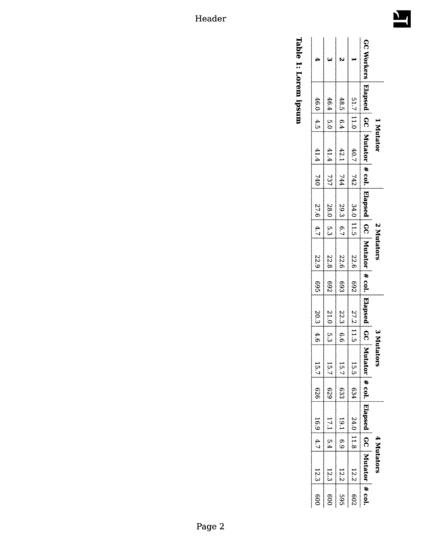

…aka the Prince Cookbook, collects recipes to achieve certain common or complex tasks useful when preparing a document for printing. Each recipe shows the required features in a "You need" ingredients list and provides a step-by-step explanation to guide you to the required goal.


Table of Contents
-----------------

<dl class="ingredients">
  <dt>You need</dt>
  <dd><a href="/doc/javascript#javascript-in-printed-media">JavaScript in Printed Media</a></dd>
  <dd><a href="#the-multi-pass-solution">The "Multi-Pass" Solution</a></dd>
  <dd><a href="/doc/gen-content#generated-content-functions">Generated Content Functions</a>
    <ul>
      <li><code>content: target-counter()</code></li>
      <li><code>content: leader()</code></li>
    </ul>
  </dd>
</dl>

Prince offers several properties and functions to facilitate the creation of a Table of Contents.

Typically, a table of contents is generated for a document by collecting the headings of each chapter, each one provided with an `id` attribute, into a list or, if necessary, also into nested lists, by means of JavaScript or in some other way, in order to generate a navigation menu for the document.

Each list item contains a hyperlink to the heading's `id`. This list functions as a navigation menu when the document is viewed in a browser.

The transformation into a proper table of contents happens with CSS when Prince generates the PDF - the resulting document will be paged, and possibly be intended for printing. It means that the hyperlinks need to be integrated with an indication of the correct page on which the target is located.

This is achieved automatically with the `target-counter()` function in the [`content`](css-props.md#prop-content) property, using the `page` counter. The URL is being automatically fetched from the `href` attribute of the hyperlink element `<a>`.

```
    #toc a::after {
      content: target-counter(attr(href), page);
    }
```
The page numbers are best styled right-aligned, while the link texts are left-aligned. An easy way to achieve this is with the `leader()` function: it defines a literal string, which expands to fill the available space on the line like justified text, by repeating the string as many times as necessary. The complete CSS entry for a simple table of contents entry thus looks like this:

```
    #toc a::after {
      content: leader('.') target-counter(attr(href), page);
    }
```
### Simple Table of Contents

Our [example document](http://css4.pub/2018/toc/index.html) generates at Table of Contents (ToC) by way of JavaScript. You can easily test it by running Prince from the command line:

```bash
    $ prince --javascript http://css4.pub/2018/toc -o toc.pdf
```
A [second example document](https://css4.pub/2020/musick/musick.html) generates at ToC by way of JavaScript and, even more impressively, the script also generates an index which is added to the end of the document when Prince runs JavaScript a second time, after layout (see [The "Multi-Pass" Solution](#the-multi-pass-solution)). Notice how subsequent page numbers in the index are folded into a range. To produce this document, try running these commands from a Linux command-line:

```bash
    $ wget https://css4.pub/2020/musick/musick.html -O musick.html;
    $ prince --javascript musick.html -o musick.pdf
```
You can view the resulting PDF [here](https://css4.pub/2020/musick/musick.pdf).

### Multifile Table of Contents

For longer books, it makes sense to split chapters into separate files. Generating a Table of Contents across all files is tricky in JavaScript since scripts only see one file at a time. In Prince, you can work around this limitation with a multi-pass solution (see [The "Multi-Pass" Solution](#the-multi-pass-solution)) where the first pass collects items for the ToC, and the second pass generates the PDF with the ToC.

To try this for yourself, first fetch these five sample files into your own file system, e.g. by running:

```bash
    $ wget http://css4.pub/2018/multifile-toc/toc.js;
    $ wget http://css4.pub/2018/multifile-toc/toc.html;
    $ wget http://css4.pub/2018/multifile-toc/ch1.html;
    $ wget http://css4.pub/2018/multifile-toc/ch2.html;
    $ wget http://css4.pub/2018/multifile-toc/style.css;
```
Then, run Prince twice:

```bash
    $ prince --javascript --script=toc.js ch1.html ch2.html -o book.pdf >> toc.html;
    $ prince toc.html ch1.html ch2.html -o book.pdf;
```
You can view the resulting PDF [here](http://css4.pub/2018/multifile-toc/book.pdf).


Thinking in Spreads
-------------------

<dl class="ingredients">
  <dt>You need</dt>
  <dd><a href="/doc/paged">Paged Media</a>
    <ul>
      <li><a href="/doc/paged#selecting-pages">Selecting pages</a></li>
      <li><a href="/doc/paged#controlling-pagination">Controlling pagination</a></li>
    </ul>
  </dd>
  <dd><a href="/doc/styling#box-model">Box Model</a></dd>
  <dd><a href="/doc/styling#prince-extensions-to-floats">Prince extensions to floats</a></dd>
  <dd><a href="/doc/styling#paragraph-formatting">Paragraph formatting</a></dd>
</dl>

Prince produces PDFs - which are a prominent example of paged media. The main difference with conventional CSS design for browsers is to always keep in mind that you are dealing with pagination, i.e. the content is placed on discrete pages.

The basic unit for paged media in print is the page, organized in page spreads: the left page, called *verso* in a left-to-right script (see [Writing Mode](styling.md#writing-mode)), and the right page, called *recto*, are of the same size and typically are symmetrical to each other and are centered on the gutter. [Selected](paged.md#selecting-pages) and [Named pages](paged.md#named-pages) can be placed *recto* or *verso*, and Prince expands several properties and the [`@page`](css-at-rules.md#at-page) at-rule pseudo-classes with the values `verso` and `recto`, or `inside` and `outside`, referring to the layout on each page of the spread to facilitate the work with page spreads.

### Pagination on a page spread

You have control on wether to place specific selected and named pages right or left, or *recto* or *verso* with the help of `break-before` and `break-after`, each of which takes the values `recto` and `verso` in addition to the traditional values.

```
    h1 {
        break-before: recto;
    }
```
This rule places an `h1` element always at the beginning of a *recto* page.

Pages can also be specifically targeted and styled with the [`@page`](css-at-rules.md#at-page) at-rule pseudo-classes `:right` and `:left`, or `:recto` and `:verso`.

### Layout on a page spread

Using the values `right` and `left` when placing elements on pages symmetrically arranged around the central gutter is possible, but rather cumbersome, since their placement depends on the placement of the page on a spread. Prince offers the extensions `inside` and `outside` to ease the task.

```
    p {
        margin: 2em;
    }
    @page:left {
        margin-right: 3em;
    }
    @page:right {
        margin-left: 3em;
    }
```
This example creates a bigger margin around the central gutter.

So, when you start thinking about the layout box model, Prince offers the properties `margin-inside` and `margin-outside` to help styling.

```
    p { 
        margin: 2em;
        margin-inside: 3em;
    }
```
This example creates a bigger margin around the central gutter, like the previous one - albeit in a shorter way.

Floats are particularly sensitive to the placement on the page with regards to whether it is a left-facing or right-facing page. Prince extends the [`float`](css-props.md#prop-float) property (and the property [`clear`](css-props.md#prop-clear)) with the values `inside` and `outside`. For details please see the chapter [Floats](styling.md#floats).

On a paragraph level, the properties [`text-align`](css-props.md#prop-text-align) and [`text-align-last`](css-props.md#prop-text-align-last) similarly take the keywords `inside` and `outside` to help achieving a smooth layout.

```
    @page:verso {
        @top-left { content: counter(page) }
        @top-right { content: string(book-title) }
    }
    @page:recto {
        @top-left { content: string(chapter-title) }
        @top-right { content: counter(page) }
    }
    h1 {
        text-align: center;
        string-set: book-title content();
    }
    h2 {
        text-align: outside;
        string-set: chapter-title content();
    }
    img {
        -prince-float: inside;
    }
```
This style snippet could be part of the stylesheet for a little booklet - it displays the page number in the upper outside corners, the book title in the upper inside of the left, or *verso* page, and the chapter title in the upper inside of the right, or *recto* page. Chapter headings are aligned to the outside of the page spreads, while any image in the book is floated close to the central gutter.


Long Tables
-----------

<dl class="ingredients">
  <dt>You need</dt>
  <dd>
<a href="/doc/styling#tables">Tables</a>
    <ul>
      <li><a href="/doc/styling#running-table-headers-and-footers">Running table headers and footers</a></li>
      <li><a href="/doc/styling#table-captions">Table captions</a></li>
    </ul>
  </dd>
</dl>

One of the main differences when designing for paged media is that you need to think about concrete pages, as opposed to a continuous flow of the page designed for the web and for web browsers. A problem may arise when elements such as tables are longer than the page they need to be displayed on.

The table itself is naturally split over several pages - but if you want table headers and footers repeated on each page, you need to code them in the HTML of the document by using the elements `thead` and/or `tfoot`. The content of these elements will be carried on to all the subsequent pages on which the table appears.

Tables can also be provided with a table caption by using the `caption` HTML element, or by styling an arbitrary element with `display: table-caption` to be made to behave like `caption` elements. The caption is positioned above the table by default, but it can be moved to the bottom with the [`caption-side`](css-props.md#prop-caption-side) property.

When a table spans across more than one page, the [`-prince-caption-page`](css-props.md#prop-prince-caption-page) property determines whether table captions will be displayed on the first page of a table, or only on the following pages, or repeated on every page that a table appears on. See also [Fancy Table Captions](#fancy-table-captions).

```
    table + p {
        display: table-caption;
        caption-side: bottom;
        -prince-caption-page: following;
    }
```

Fancy Table Captions
--------------------

<dl class="ingredients">
  <dt>You need</dt>
  <dd>
<a href="/doc/styling#tables">Tables</a>
    <ul>
      <li><a href="/doc/styling#table-captions">Table captions</a></li>
    </ul>
  </dd>
  <dd><a href="#long-tables">Long Tables</a></dd>
</dl>

HTML tables only have one caption per table. However, in printed form a table might span several pages (see [Long Tables](#long-tables)) and it might be desirable to have separate captions for the first and the following pages - you might want to add "cont." to the caption of the first one, or otherwise differentiate them. Prince offers an extension mechanism to do so.

As mentioned in [Long Tables](#long-tables), when a table spans across more than one page, the [`-prince-caption-page`](css-props.md#prop-prince-caption-page) property determines whether table captions will be displayed on the first page of a table, or only on the following pages, or repeated on every page that a table appears on. This opens up the possibility to have a different caption on the first and on the following pages.

You might define a caption in HTML for the main table caption - to be displayed on the first page. Additionally, you make another element into a table caption with the [`display`](css-props.md#prop-display) property - and display it only on the following pages!

The paragraph functioning as a table caption can be hidden in browsers by using [CSS Media Queries](css-media-queries.md#media-queries).

HTML

```html
    <table>
      <caption>Demo table</caption>
      <tr>
        <td>A</td>
        <td>B</td>
      </tr>
      <tr>
        <td>C</td>
        <td>D</td>
      </tr>
      <tr>
        <td>E</td>
        <td>F</td>
      </tr>
    </table>
    <p>Demo table (cont.)</p>
```
CSS

```
    caption {
        caption-side: bottom;
        -prince-caption-page: first;
    }
    table + p {
        display: table-caption;
        caption-side: bottom;
        -prince-caption-page: following;
    }
```

Page Headers and Footers
------------------------

<dl class="ingredients">
  <dt>You need</dt>
  <dd><a href="/doc/paged#page-regions">Page regions</a></dd>
  <dd><a href="/doc/gen-content">Generated Content</a></dd>
</dl>

When preparing a document for print, "running" headers and footers repeating on every page, such as page numbering and titles of the book and of the current chapter, are a common need.

Prince uses CSS for these headers and footers and for styling them.

Each page is structured in [Page regions](paged.md#page-regions) - most page content is located inside the *page area*, including the [Footnotes](styling.md#footnotes), but the *page-margin boxes* contain most of the content repeating in slightly varied way across the whole book - the running headers and footers.

A typical case is page numbering, which can easily be obtained with [Generated Content](gen-content.md): the current page number can be printed in a page region with the [`content`](css-props.md#prop-content) property. (See also [Page Numbering](#page-numbering)).

```
    @page {
        @bottom {
            content: counter(page)
        }
    }
```
By using [Named pages](paged.md#named-pages), you can style the page numbering of the Preface with roman numbers and the main pages with arabic numbers - see the example [Restarting page numbering](paged.md#fig-restart-page-numbers).

The title of the book, or the current chapter, can be copyied into the page regions by using the [string-set](css-props.md#prop-string-set) property. For details, please see the [Copying content from the document](paged.md#copying-content-from-the-document) chapter.

CSS

```
    @page {
        @top { content: string(doctitle) }
    }

    h1 { string-set: doctitle content() }
```
The @page rule specifies that the top-center page region will contain the text content of the document title copied from the text content of the `h1` element in the document.

If some special formatting of the text in the margin box is required, copying the text will not suffice - you need to remove an element from the natural page flow to place it in the margin box. See [Taking elements from the document](paged.md#taking-elements-from-the-document) for details.


Dictionary Page Headers
-----------------------

<dl class="ingredients">
  <dt>You need</dt>
  <dd><a href="/doc/paged#page-regions">Page regions</a></dd>
  <dd><a href="/doc/gen-content">Generated Content</a></dd>
  <dd>
<a href="/doc/gen-content#the-optional-page-policy-value">The optional page-policy value</a>
    <ul>
      <li><code>content: string(term, <b>first</b>)</code></li>
      <li><code>content: string(term, <b>last</b>)</code></li>
    </ul>
  </dd>
</dl>

A peculiar and interesting use of page headers happens in dictionaries: typically, you might want to display page headers like "a-af", where "a" is the first definition on the page and "af" is the last one. This can easily be obtained by adding [The optional page-policy value](gen-content.md#the-optional-page-policy-value) to the `string()` function.

The [`string-set`](css-props.md#prop-string-set) property is applied to each definition in the dictionary (the `b:first-child` from the following example), and then the `first` and `last` page policy values are use to select the relevant definition to display in the page header.

```
    @page {
      @top-left { content: string(term, first);}
      @top-right { content: string(term, last);}
    }
    .chapter p b:first-child { string-set: term content() }  /* pick up term to be used in running header */
```
This is the crucial set of rules for the [Dictionary](/samples/#dictionary) sample.

The dictionary sample is furthermore noticeable for its use of the optional page policy keyword `first-except`: the current letter of the alphabet is displayed on each page heading, *except* for the page on which the letter appears in the body of the page, starting the new section.

```
    @page {
      @top-center { content: string(letter, first-except);}
    }
    .chapter header { string-set: letter content() }
```

Page Numbering
--------------

<dl class="ingredients">
  <dt>You need</dt>
  <dd>
<a href="/doc/paged">Paged Media</a>
    <ul>
      <li><a href="/doc/paged#selecting-pages">Selecting pages</a></li>
    </ul>
  </dd>
  <dd>
<a href="/doc/gen-content">Generated Content</a>
    <ul>
      <li>
<a href="/doc/gen-content#counters-and-numbering">Counters and Numbering</a>
        <ul>
          <li><code>content: counter(page)</code></li>
        </ul>
      </li>
    </ul>
  </dd>
</dl>

Paged media is organized in pages - and numbering the pages is a common task: generated content does this for you automatically. The easiest way of doing so is numbering them sequentially from the first to the last page.

To use a counter, it usually first needs to be initialized with the [`counter-reset`](css-props.md#prop-counter-reset) property, which can be applied to any element and initializes one or more counters to the specified values, or to zero if no value is specified. Once initialized, the counter will be displayed with the `counter()` function in the [`content`](css-props.md#prop-content) property.

Page counters work a bit more simple and usually don't need to be explicitly initialized or incremented.

```
    @page {
      @bottom {
        content: counter(page);
      }
    }
```
However, if you want to restart the numbering after the Preface of your book, you need to name the pages (see [Named pages](paged.md#named-pages)) and the counter needs to be re-initialized with the main content. See also the example [Restarting page numbering](paged.md#fig-restart-page-numbers).

```css
    .preface {
      page: preface;
      counter-reset: page 1;
    }
    @page preface {
      @bottom {
        content: counter(page, lower-roman);
      }
    }
    .main {
      page: main;
      counter-reset: page 1;
    }
    @page main {
      @bottom {
        content: counter(page);
      }
    }
```
The page numbers can be referenced with the `target-counter()` function. This provides a convenient mechanism when you want to print out a page reference that on an interactive medium, such as can be seen in a web browser, might be expressed with a hyperlink.

CSS

```
    a[href]::after {
        content: " [See page " target-counter(attr(href), page) "]";
    }
```
This will add a cross-reference after every link with the correct page number determined automatically. For example: \[See page 17\].

If you are referencing the pages in the Preface, marked with lower roman-style numbers, you need to re-specify the counter style for the target counter - the style is not automatically taken over.

CSS

```
    a[href|="#preface"]::after {
        content: " [See page " target-counter(attr(href), page, lower-roman) "]";
    }
```
In some documents, particularly those that are unbound such as office documents, it can be useful to show the total number of pages on each page. The total number of pages can be accessed by using the `pages` counter. This is a pre-defined counter that is fixed to the total number of pages in the document.

```
    @page {
      @bottom {
        content: "Page " counter(page) " of " counter(pages);
      }
    }
```
This rule will generate page footers such as "Page 1 of 89".


Multiple Footnotes
------------------

<dl class="ingredients">
  <dt>You need</dt>
  <dd><a href="/doc/styling#prince-extensions-to-floats">Prince extensions to floats</a></dd>
  <dd>
<a href="/doc/styling#footnotes">Footnotes</a>
    <ul>
      <li><code>float: footnote</code></li>
    </ul>
  </dd>
  <dd><a href="/doc/gen-content#generated-content-functions">Generated Content Functions</a></dd>
  <dd><a href="/doc/gen-content#using-target-counter">Using <code>target-counter()</code></a></dd>
</dl>

In some cases it might happen that you want to point several footnote calls at the same footnote. Prince offers a convenient mechanism to achieve this by combining regular footnotes with the generated content function `target-counter()`.

First we create our regular footnotes - the only extra step we need to do, is to provide each footnote with a unique ID.

```html
    <p>
    This paragraph has a footnote.<span class="fn" id="fn1">First footnote.</span>
    </p>
```
When another foonote call needs to be pointing at this, already existing footnote, we have to create it manually by adding a link to this footnote's ID.

```html
    <p>
    This paragraph refers to the first footnote.<a class="rfn" href="#fn1"></a>
    </p>
```
This footnote call will be created by using the generated content function `target-counter()` referencing the footnote counter.

```
    content: target-counter(attr(href), footnote);
```
When creating regular footnotes, Prince automatically takes care of the styling of the footnote calls, but the manually created ones need to be explicitly styled. The following are the default rules that style a footnote call - here shown with all the rules necessary for creating all the footnote calls:

```
    .fn {
        float: footnote;
    }

    .rfn {
        color: inherit;
        text-decoration: none;
        content: target-counter(attr(href), footnote);
        vertical-align: super;
        line-height: none;
        font-size: 83%;
    }
```

Sidenotes
---------

<dl class="ingredients">
  <dt>You need</dt>
  <dd><a href="/doc/styling#prince-extensions-to-floats">Prince extensions to floats</a></dd>
  <dd>
<a href="/doc/styling#footnotes">Footnotes</a>
    <ul>
      <li><code>float: footnote</code></li>
    </ul>
  </dd>
  <dd><a href="/doc/styling#styling-and-behavior-of-footnotes">Styling and behavior of footnotes</a></dd>
</dl>

Prince has a simple way of creating footnotes: the `@footnote` page area, where footnotes can be floated to with the [`float`](css-props.md#prop-float) property. For details see [Footnotes](styling.md#footnotes).

It gets slightly more complicated when you want to position the footnotes not under the text, in their default position, but at the side of the pages as sidenotes. Two approaches are possible, each with its advantages and drawbacks. Either

-   the footnote area is positioned to the side of the page (see also [Styling and behavior of footnotes](styling.md#styling-and-behavior-of-footnotes)), or
-   the sidenotes are floated not to the footnote area, but simply to the left or right side of the page.

We shall see each approach separately.

### Positioning the footnote area

A straightforward approach for sidenotes is to position the footnote area to the desired place, instead of leaving it in its default position.

```
    @page {
        @footnote {
            position: absolute;
            left: -90px;
            width: 60px;
        }
    }
```
This rule moves the footnotes area to the left side of a page.

The advantage of this approach is that footnote calls and markers are created automatically (see [Footnote calls](styling.md#footnote-calls) and [Footnote markers](styling.md#footnote-markers)).

The biggest disadvantage is that the footnotes are not placed to the side of the location of the footnote calls, but are inserted into the footnote page area filling the space from the top of the page. Should this be of importance, use the second approach instead.

### Floating the footnote left or right

The footnote text is floated to the left (or right) and moved out of the way with negative margins.

```
    .footnote {
      float: left;
      max-width: 60px;
      margin-left: -90px;
    }
```
This rule floats the footnotes to the left side of a page.

The advantage is to position the footnotes vertically aligned with the footnote calls.

The disadvantage is that footnote calls and markers are not created automatically, but need to be manually added as counters, and styled. Also, footnotes may overlap vertically if they are too close together.

A variant of this approach, useful when creating floating sidenotes in a multicol layout, can make use of some scripting to determine, with the help of [The Box Tracking API](javascript.md#the-box-tracking-api), in which column the sidenote call, and thus the sidenote, is placed - making sure the sidenote is always in the correct position. You can see this in full action in the Sidenotes samples:

-   In a small two-column demo document, sidenotes that naturally appear in the first column are shown on the left side. And sidenotes in the second column are shown on the right side. This is done by adding a class name to elements based on which column they naturally appear in ("col1", "col2") ([HTML](https://css4.pub/2020/sidenotes/index.html) - [PDF](https://css4.pub/2020/sidenotes/index.pdf)).
-   In this demo, sidenotes are placed in the margin area, stacked from the top. The sidenotes are absolutely positioned by setting a style attribute with a carefully computed 'top' value. Sidenotes remain on the page where they naturally occur ([HTML](https://www.css4.pub/2020/sidenotes/top.html) - [PDF](https://www.css4.pub/2020/sidenotes/top.pdf)).
-   Yet another variation, one where the figure caption is placed in the margin, below or above the figure depending on the figure's placement on the page ([HTML](https://www.css4.pub/2020/sidenotes/caption.html) - [PDF](https://www.css4.pub/2020/sidenotes/caption.pdf)).
-   And finally, a document with several types of sidenotes: (1) baseline-aligned sidenotes (2) top-of-page-aligned sidenotes, and (3) sidenotes placed above or below full-width figures. The script tries to detect and avoid overlap in the margin area, and images are (slightly) resized to align with the text. This solution is not fully battle-tested yet, but it shows potential ([HTML](https://www.css4.pub/2020/christian-krohg/hg.html) - [PDF](https://www.css4.pub/2020/christian-krohg/hg.pdf)).

To format the latter one, just run:
```bash
    prince -j https://www.css4.pub/2020/christian-krohg/hg.html -o hg.pdf
```


Endnotes
--------

<dl class="ingredients">
  <dt>You need</dt>
  <dd><a href="/doc/javascript">Scripting</a></dd>
</dl>

Endnotes are quite easy as their placement is not relative to the page. There are two ways of creating them.

In their most simple form, an endnote is placed at the end of the document by the author, with a (hyperlinked) call in the text.

However, it can be laborious to manually synchronize references in this manner. A more convenient alternative is to keep the notes inline and to move them to the end of the document at the time of formatting. This is a simple tree transformation which can be performed by a script. The following sample document features references which are kept inline and moved to the end by a script:

-   [HTML document](http://css4.pub/2015/usenix/example.html)
-   [PDF document](http://css4.pub/2015/usenix/example.pdf)

No special CSS formatting is required to support endnotes.

In a similar fashion table notes can be created. These are a variation of endnotes. However, instead of moving the notes to the end of the document, the notes are moved to the end of the table, or to the end of the table cell. Again, this is a simple tree transformation which doesn't require anything special from CSS.

The table in the above document sample also has inline notes that are moved to the end of the table by a script.


Hyperlinks in Print
-------------------

<dl class="ingredients">
  <dt>You need</dt>
  <dd><a href="/doc/gen-content">Generated Content</a></dd>
  <dd><a href="/doc/gen-content#generated-content-functions">Generated Content Functions</a></dd>
  <dd>
<a href="/doc/gen-content#cross-references">Cross-references</a>
    <ul>
      <li><a href="/doc/gen-content#using-target-counter">Using <code>target-counter()</code></a></li>
      <li><a href="/doc/gen-content#using-target-content">Using <code>target-content()</code></a></li>
    </ul>
  </dd>
</dl>

Hyperlinks are a direct reference to another location, easy to follow on the interactive web page, or a PDF loaded in a viewer, by clicking on it. On the printed page, this mechanism obviously does not work.

Prince offers some CSS functions to help translating hyperlinks into print-friendly display, useful in different scenarios: `target-counter()`, `target-content()` and `attr()`, to be used with the [`content`](css-props.md#prop-content) property. (See also [Generated Content Functions](gen-content.md#generated-content-functions)).

The `target-counter()` function can be used to reference the value of a counter at a linked element, and it can specify any counter, allowing cross-references to refer to list items, chapters or sections as well as pages.

Used with generated content after a hyperlink, it will add a cross-reference with the correct page number determined automatically.

CSS

```
    a[href]::after {
        content: " [See page " target-counter(attr(href), page) "]"
    }
```
This adds something like "\[See page 17\]" after each link. Note the use of the function `attr()` inside the `target-counter()` function.

It can also take an optional counter style, similar to the normal `counter()` function.

CSS

```
    a[href]::after {
        content: " [See chapter "
                 target-counter(attr(href), chapter, upper-roman)
                 "]"
    }
```
This will add a cross-reference after every link with the correct chapter number determined automatically and displayed using roman numerals. For example: "\[See chapter IV\]".

The `target-content()` function can be used to reference the text content of the linked element.

CSS

```
    a[href]::after {
        content: " [See '" target-content(attr(href)) "']"
    }
```
This will add a cross-reference after every link that includes the text of the element being linked to, such as a chapter title. For example: "\[See 'Introduction'\]".

The `attr()` function, used in the previous examples inside the other functions, can also be used on its own to insert the URL of a remote resource.

CSS

```
    a[href]::after {
        content: " [Located at '" attr(href) "']";
    }
```
This will add the URL after every link. For example: "\[Located at 'http://www.princexml.com/&#8203;'\]".


Image Magic
-----------

<dl class="ingredients">
  <dt>You need</dt>
  <dd><a href="/doc/graphics#images">Images</a></dd>
  <dd>
<a href="/doc/graphics#css-and-images">CSS and Images</a>
    <ul>
      <li><code>-prince-image-magic</code></li>
    </ul>
  </dd>
</dl>

The [`-prince-image-magic`](css-props.md#prop-prince-image-magic) property performs various image-related, Prince-specific tasks that do not fit into other existing CSS properties. It applies magic to images!

To reduce the PDF file size, JPEG images can be recompressed at a lower quality level by using the function `recompress-jpeg(quality%)` with the required quality percentage as argument.

PNG images can be converted to JPEG images with the keyword `convert-to-jpeg` (using the default compression rate), or they can also be converted to JPEG with the required compression rate as argument with the function `convert-to-jpeg(quality%)`.

Prince usually strips unnecessary metadata from JPEG images to help contain size. But it might happen that you need that extra data, possibly for further downstream processing. The keyword `jpeg-verbatim` inhibtis this stripping and includes the images without modification in the PDF file.

Two more keywords perform more obscure tasks that might be required in very specific circumstances: the keyword `ignore-icc-profile` causes Prince to ignore any ICC color profile embedded in the image, useful e.g. in those cases when the embedded ICC profile is broken; and `snap-to-integer-coords` can be used to avoid blurring of images in some PDF viewers.

Several of the values can be combined, to perform more than one magic on images - for details please check the grammar of the [`-prince-image-magic`](css-props.md#prop-prince-image-magic) property.

```
    img {
        -prince-image-magic: recompress-jpeg(50%) convert-to-jpeg(50%) snap-to-integer-coords;
    }
```
This example recompresses all JPEG images to 50%, converts any non-JPEG images to JPEG with the same quality, and snaps them all to integer coordinates to avoid blurring in some PDF viewers.


Hyphenation
-----------

<dl class="ingredients">
  <dt>You need</dt>
    <dd>
<code><a href="/doc/css-props#prop-hyphens">hyphens</a></code>
      <ul>
        <li><code><a href="/doc/css-props#prop-prince-hyphenate-character">-prince-hyphenate-character</a></code></li>
        <li><code><a href="/doc/css-props#prop-prince-hyphenate-before">-prince-hyphenate-before</a></code></li>
        <li><code><a href="/doc/css-props#prop-prince-hyphenate-after">-prince-hyphenate-after</a></code></li>
        <li><code><a href="/doc/css-props#prop-prince-hyphenate-limit-lines">-prince-hyphenate-limit-lines</a></code></li>
        <li><code><a href="/doc/css-props#prop-prince-hyphenate-patterns">-prince-hyphenate-patterns</a></code></li>
      </ul>
    </dd>
</dl>

The property [`hyphens`](css-props.md#prop-hyphens) controls whether hyphenation is allowed to create opportunities to wrap within a line of text.

The default value of the [`hyphens`](css-props.md#prop-hyphens) property is `manual` - to enable automatic hyphenation in a body of text, the value `auto` has to be declared.

The value `none` instructs never to hyphenate, while the default value `manual` tells Prince to only hyphenate when there are characters inside the word that explicitly suggest hyphenation opportunities, such as e.g. "soft hyphens" (represented either by the Unicode character `U+00AD` or the HTML entity `&shy;`). With the value `auto`, words may be broken at appropriate hyphenation points as determined automatically by the language-appropriate hyphenation resources, or by hyphenation characters in a word.

In order to make automatic hyphenation work as intended, it is important to communicate to Prince the natural language the text is in, so that the language-specific hyphenation rules can be applied - this is done by means to the `lang` or `xml:lang` attributes.

The character shown at the end of a line when the word is hyphenated can be specified with the [`-prince-hyphenate-character`](css-props.md#prop-prince-hyphenate-character) property.

Fine-tuning of hyphenation can be done with the `-prince-hyphenate-after` and `-prince-hyphenate-before` properties to determine the minimum number of letters in a word that may be moved to the next line or that may be left at the end of a line when the word is hyphenated.

The [`-prince-hyphenate-limit-lines`](css-props.md#prop-prince-hyphenate-limit-lines) property is used to determine the maximum number of consecutive lines that may end with a hyphenated word.

Prince uses the hyphenation patterns from the CTAN archive - the full archive is accessible [here](http://tug.ctan.org/tex-archive/language/hyph-utf8/tex/generic/hyph-utf8/patterns/txt/). The default hyphenation patterns can be found in the installed `hyph.css` file, located in the default style sheets location (see [Installation Layout](installing.md#installation-layout)).

Hyphenation patterns for the following languages are provided:

<table class="grid">
  <tr>
    <td>da</td>
    <td>Danish</td>
  </tr>
  <tr>
    <td>de</td>
    <td>German</td>
  </tr>
  <tr>
    <td>en-US</td>
    <td>English</td>
  </tr>
  <tr>
    <td>es</td>
    <td>Spanish</td>
  </tr>
  <tr>
    <td>fi</td>
    <td>Finnish</td>
  </tr>
  <tr>
    <td>fr</td>
    <td>French</td>
  </tr>
  <tr>
    <td>is</td>
    <td>Icelandic</td>
  </tr>
  <tr>
    <td>it</td>
    <td>Italian</td>
  </tr>
  <tr>
    <td>lt</td>
    <td>Lithuanian</td>
  </tr>
  <tr>
    <td>pl</td>
    <td>Polish</td>
  </tr>
  <tr>
    <td>pt</td>
    <td>Portuguese</td>
  </tr>
  <tr>
    <td>ru</td>
    <td>Russian</td>
  </tr>
  <tr>
    <td>sl</td>
    <td>Slovenian</td>
  </tr>
  <tr>
    <td>sv</td>
    <td>Swedish</td>
  </tr>
</table>

A special case is Thai hyphenation, supported thanks to the [LibThai](http://linux.thai.net/projects/libthai) package.

To add hyphenation patterns for other languages, download them from the [CTAN archive](http://tug.ctan.org/tex-archive/language/hyph-utf8/tex/generic/hyph-utf8/patterns/txt/). Save the files for the chosen language without the `.txt` extension, and link to the pattern file (with the `.pat` extension) with the [`-prince-hyphenate-patterns`](css-props.md#prop-prince-hyphenate-patterns) CSS property.

The renaming of the file is not essential - the content, not the extension counts.

Prince determines which language to use for hyphenation with the help of the `:lang()` CSS selector, which in turn checks the `lang` or `xml:lang` attributes of the document:

```
    :lang(en-GB) {
        -prince-hyphenate-patterns: url("hyph-en-gb.pat");
    }
```
```html
    <span lang="en-GB">supercalifragilisticexpialidocious</span>
```
Alternatively, link directly to the required remote hyphenation file:

```
    :lang(en-GB) {
        -prince-hyphenate-patterns: url("http://tug.ctan.org/tex-archive/language/hyph-utf8/tex/generic/hyph-utf8/patterns/txt/hyph-en-gb.pat.txt");
    }
```
```html
    <span lang="en-GB">supercalifragilisticexpialidocious</span>
```

Typographic Ligatures
---------------------

<dl class="ingredients">
  <dt>You need</dt>
    <dd><a href="/doc/styling#opentype-features-in-prince">OpenType Features in Prince</a></dd>
    <dd><code><a href="/doc/css-props#prop-font-variant-ligatures">font-variant-ligatures</a></code></dd>
    <dd><code><a href="/doc/css-props#prop-font-variant">font-variant</a>: prince-opentype()</code></dd>
    <dd><code><a href="/doc/css-props#prop-prince-text-replace">-prince-text-replace</a></code></dd>
</dl>

Prince supports typographic ligatures found in OpenType fonts, i.e. Prince will replace certain characters that appear next to each other with other special glyphs that join those two characters together into one single glyph.

A prominent example of a typographic ligature is **fi**, which replaces the two characters **<span>f</span><span>i</span>** with a single glyph.

Prince automatically enables ligatures declared by the OpenType fonts with the `liga` feature (see [OpenType Features in Prince](styling.md#opentype-features-in-prince)). This feature covers the "standard ligatures" which the font manufacturer thinks should be used in normal conditions. Microsoft has a list of the OpenType feature names [here](https://www.microsoft.com/typography/otspec/featurelist.htm).

Other special ligatures need to be explicitly enabled in Prince to take effect. This is achieved by using the [`font-variant-ligatures`](css-props.md#prop-font-variant-ligatures) CSS property.
Note that the property [`font-variant`](css-props.md#prop-font-variant) can be used as a shorthand for enabling this, and possibly other font features.

Another means to enable ligatures is through the [`font-variant`](css-props.md#prop-font-variant) CSS property with the `prince-opentype()` function (see [CSS Functional Expressions](css-functions.md)).  However, care must be taken in which order the features are enabled!  Also, enabling one feature will disable all the default features. To see which OpenType features are enabled by default, see the [OpenType Features in Prince](styling.md#opentype-features-in-prince) section.

```
    body {
        font-variant-ligatures: historical-ligatures;
    }
```

The most commn type of ligatures, the OpenType feature `liga`, is enabled by default.  Unlike other ligature features, the `clig` feature specifies the context in which the ligature is recommended. "Contextual ligatures" are important in some script designs.  Both these ligatures are enabled with the value `common-ligatures`.

The `dlig` feature covers the "discretionary ligatures" which may be used for special effects. To enable them, use the value `discretionary-ligatures`.

Some ligatures were in common use in the past, such as ligatures with the so-called "long s" - but they appear anachronistic today. Some fonts include the historical forms as alternates, so the "historical ligatures", covered by the `hlig` feature, can be used for a 'period' effect. This feature replaces the default (current) forms with the historical alternates. To enable these ligatures, use the value `historical-ligatures`.

Some scripts, most notably Arabic and Syriac scripts, require certain ligatures to be used in normal conditions. These "required ligatures" are covered by the `rlig` feature. Prince enables this feature by default in Arabic script. The only way to manually enable this feature is through the `prince-opentype()` function of the [`font-variant`](css-props.md#prop-font-variant) CSS property.

Another mechanism for replacing specific characters is given with the [`-prince-text-replace`](css-props.md#prop-prince-text-replace) property. For an example use, please see the section on [Character Entities](characters.md).


Watermarks
----------

<dl class="ingredients">
  <dt>You need</dt>
    <dd>
<a href="/doc/paged#page-regions">Page regions</a>
      <ul>
        <li><code>@prince-overlay</code></li>
      </ul>
    </dd>
    <dd><a href="/doc/paged#generated-content-in-page-regions">Generated content in page regions</a></dd>
    <dd><a href="/doc/paged#taking-elements-from-the-document">Taking elements from the document</a></dd>
</dl>

When producing a PDF, it might be desirable to include a watermark, visible on all pages. In Prince it is easy to do so with CSS.

In order to repeat it on all pages, the watermark needs to be placed in a [`@page`](css-at-rules.md#at-page) at-rule. We shall place it in the page region `@prince-overlay` (see [Page regions](paged.md#page-regions)) and create the watermark with generated content (see [Generated content in page regions](paged.md#generated-content-in-page-regions)):

```
    @page {
       @prince-overlay {
          color: rgba(0,0,0,0.8);
          content: "Watermark";
          font-size: 20pt;
       }
    }
```
The overlay can be styled in all possible ways and it can be aligned in other places than middle center:

```
    @page {
       @prince-overlay {
          content: "Watermark";
          vertical-align: top;
       }
    }
```
Currently it is only possible to have one overlay, but you could flow an entire element having multiple individually positioned contents (see [Taking elements from the document](paged.md#taking-elements-from-the-document)).

The styled watermark can be saved into a `watermark.css` file, which will be called when generating the document:

```bash
    prince --style=watermark.css myfile.md -o myfile_with_watermark.pdf
```

Rotating content
----------------

Sometimes it is necessary to rotate a block element so that it fits on the page. This is common with tables. Two approaches are possible: either the whole page is [printed sideways](#printing-wide-content-sideways), or only [the content in a table cell is rotated](#rotating-content-in-table-cells). We shall see each approach separately.

### Printing wide content sideways

<dl class="ingredients">
  <dt>You need</dt>
    <dd><code><a href="/doc/css-props#prop-prince-rotate-body">-prince-rotate-body</a></code></dd>
    <dd><code><a href="/doc/css-props#prop-prince-shrink-to-fit">-prince-shrink-to-fit</a></code></dd>
</dl>

Figure [Printing a big table sideways](#printing-wide-content-sideways) shows a table, rotated so that its width fits within the page's length. This can be achieved with the following rules:

Printing a big table sideways


This table is too wide to fit on the paper, so we use `-prince-rotate-body` in a *named page* to print it sideways. Download the [PDF](assets/samples/rotate-body.pdf) or the [HTML](assets/samples/rotate-body.html).

```
    @page big_table {
        -prince-rotate-body: landscape;
        -prince-shrink-to-fit: auto;
    }

    table.big {
        page: big_table
    }
```
The [`-prince-rotate-body`](css-props.md#prop-prince-rotate-body) property works within [`@page`](css-at-rules.md#at-page) rules only, so this example uses a named page to place the table on a page of its own. Then the [`@page`](css-at-rules.md#at-page) rule for `big_table` pages uses the [`-prince-rotate-body`](css-props.md#prop-prince-rotate-body) property to tell prince that the body of the page, but not the headers and footers, should be rotated. The table in this example is still too wide so we also use the [`-prince-shrink-to-fit`](css-props.md#prop-prince-shrink-to-fit) property to make it a little smaller.

If you download the full example ([HTML](assets/samples/rotate-body.html) or [PDF](assets/samples/rotate-body.pdf)) you will see that the paragraphs before and after the table are not placed on the same page. This is because they do not belong to the same named page (see [Named pages](paged.md#named-pages)). However on page four there are two tables, both tables belong to the same named page and therefore Prince will try to place them together on the same page.

Another way of rotating content is by changing the writing mode with the [`writing-mode`](css-props.md#prop-writing-mode) property, or by transforming an element with `transform: rotate()` - see [Rotating content in table cells](#rotating-content-in-table-cells).

### Rotating content in table cells

<dl class="ingredients">
  <dt>You need</dt>
    <dd><code><a href="/doc/css-props#prop-transform">transform</a>: rotate()</code></dd>
    <dd><code><a href="/doc/css-props#prop-writing-mode">writing-mode</a></code></dd>
</dl>

There are cases, when preparing a table with a large amount of content, that you would like to configure your layout to be most efficient - a useful trick is to rotate the content in some table cells, or in the table headers. Rotating by 90° might be a way to achieve this, but readability suffers. A reasonable compromise is to rotate 45° only - the space it needs is not more than with a 90° rotation, and your readers don't have to tilt their heads repeatedly. In the following example we shall rotate table headers by 45°.

The rotation is achieved with `transform: rotate()`. It could be applied directly to the `th` element, but it is impossible to configure the width of the column as we wish it. We shall thus nest a `div` and a `span` element:

```html
    <th class="rotate">
      <div>
        <span>Column header 1</span>
      </div>
    </th>
```
The rotation will happen with the following CSS code:

```
    th.rotate {
      /* Make sure the th is high enough, */
      height: 150px;
      /* and make sure the words of the header are not split with a newline. */
      white-space: nowrap;
    }

    th.rotate > div {
      transform:
        /* Magic Numbers to put it in place, */
        translate(25px, 50px)
        /* rotate it, */
        rotate(-45deg);
      /* and give the div the width you wish. */
      width: 30px;
    }
    th.rotate > div > span {
      /* And finally, add some styling. */
      border-bottom: 1px solid #ccc;
      padding: 5px 10px;
    }
```
A more basic means for rotation, allowing for less fine-tuning, is the use of the [`writing-mode`](css-props.md#prop-writing-mode) CSS property. This option only allows rotation by 90°. It can be very handy when only some table cells with too much content are rotated, so as not to use too much horizontal space. You cannot rotate the table cell directly, so you have to nest one `span` element inside - and then you style it:

```
    td.rotate > span {
      /* Rotate the content */
      writing-mode: vertical-rl;
      /* Optionally, you can force the table cell's content not to wrap */
      white-space: nowrap;
    }
```
For a different approach to rotating content, see the section on [Printing wide content sideways](#printing-wide-content-sideways).


How and Where is my Box?
-------------

<dl class="ingredients">
  <dt>You need</dt>
    <dd><a href="/doc/javascript#the-prince-object">The Prince Object</a></dd>
    <dd><a href="/doc/javascript#the-box-tracking-api">The Box Tracking API</a></dd>
</dl>

The `BoxInfo()` method returns a list of *boxes*, each of which has a series of properties defining them.

The following script adds some useful higher-level functionality, making the `marginBox(u)`, `borderBox(u)`, `paddingBox(u)` and `contentBox(u)` methods available on the BoxInfo objects. The parameter `u` defines the units to use, and needs to be one of `cm`, `in`, `mm`, `q`, `pc`, `pt` or `px`.

The methods return a box object with properties `x`, `y`, `w` and `h`, giving the position and size of the box in the requested units.

```javascript
    if (typeof Prince != "undefined") {
        addBoxInfoMethods();
    }
    
    function Box(x, y, w, h, u) {
        var d = 1;
    
        if (u == "cm") {
            d = 72/2.54;
        } else if (u == "in") {
            d = 72;
        } else if (u == "mm") {
            d = 72/25.4;
        } else if (u == "q") {
            d = 72/101.6;
        } else if (u == "pc") {
            d = 1/12;
        } else if (u == "pt") {
            d = 1;
        } else if (u == "px") {
            d = 72/96;
        } else {
            console.log("Box: unknown units: " + u);
        }
    
        this.x = x/d;
        this.y = y/d;
        this.w = w/d;
        this.h = h/d;
    }
    
    function addBoxInfoMethods() {
        BoxInfo.prototype.marginBox = function (u) {
            var x = this.x - this.marginLeft;
            var y = this.y + this.marginTop;
            var w = this.w + this.marginLeft + this.marginRight;
            var h = this.h + this.marginTop + this.marginBottom;
            return new Box(x, y, w, h, u);
        };
    
        BoxInfo.prototype.borderBox = function (u) {
            var x = this.x;
            var y = this.y;
            var w = this.w;
            var h = this.h;
            return new Box(x, y, w, h, u);
        };
    
        BoxInfo.prototype.paddingBox = function(u) {
            var bTop = parseFloat(this.style.borderTopWidth.slice(0, -2));
            var bRight = parseFloat(this.style.borderRightWidth.slice(0, -2));
            var bBottom = parseFloat(this.style.borderBottomWidth.slice(0, -2));
            var bLeft = parseFloat(this.style.borderLeftWidth.slice(0, -2));
            var x = this.x + bLeft;
            var y = this.y - bTop;
            var w = this.w - bLeft - bRight;
            var h = this.h - bTop - bBottom;
            return new Box(x, y, w, h, u);
        };
    
        BoxInfo.prototype.contentBox = function(u) {
            var bTop = parseFloat(this.style.borderTopWidth.slice(0, -2));
            var bRight = parseFloat(this.style.borderRightWidth.slice(0, -2));
            var bBottom = parseFloat(this.style.borderBottomWidth.slice(0, -2));
            var bLeft = parseFloat(this.style.borderLeftWidth.slice(0, -2));
            var pTop = parseFloat(this.style.paddingTop.slice(0, -2));
            var pRight = parseFloat(this.style.paddingRight.slice(0, -2));
            var pBottom = parseFloat(this.style.paddingBottom.slice(0, -2));
            var pLeft = parseFloat(this.style.paddingLeft.slice(0, -2));
            var x = this.x + bLeft + pLeft;
            var y = this.y - bTop - pTop;
            var w = this.w - bLeft - bRight - pLeft - pRight;
            var h = this.h - bTop - bBottom - pTop - pBottom;
            return new Box(x, y, w, h, u);
        };
    }
```

To use the features, the script just needs to be included in the HTML directly as a script, or as an imported JavaScript file.  It is then easy to detect e.g. the width of the content:

```javascript
    var e = document.getElementById("someId");
    var b = e.getPrinceBoxes()[0];
    console.log("Content width is " + b.contentBox("cm").w + "cm");
```


The "Multi-Pass" Solution
-----------------------

<dl class="ingredients">
  <dt>You need</dt>
    <dd><a href="/doc/javascript#javascript-in-printed-media">JavaScript in Printed Media</a></dd>
    <dd><a href="/doc/javascript#event-handling">Event Handling</a></dd>
    <dd>
      <a href="/doc/javascript#the-prince-object">The Prince Object</a>
      <ul>
        <li><a href="/doc/javascript#multi-pass-formatting">Multi-Pass formatting</a></li>
      </ul>
    </dd>
</dl>

One limitation of producing a document intended for print is its non-interactive, static nature: in principle a document cannot be modified after it is deemed to be ready for print. See [JavaScript in Printed Media](javascript.md#javascript-in-printed-media).

JavaScript can basically be run twice: the first time it is run before layout, where it interacts with and modifies the layout (and the DOM structure). Once layout is finished, JavaScript can be run a second time from the `complete` event handler (see [Event Handling](javascript.md#event-handling)) to inspect the layout, without modifying the DOM - the results might be printed to console for monitoring the document for mistakes.

A problematic situation arises when you want to modify your document after layout has finished - a typical scenario would be when you want an index to be created with correct page numbers. The content depends on the layout of the document itself.

(Please note that this recipe only addresses the creation of an index - a simple table of contents or a reference to a place on another page can easily be achieved with [target-counter links](gen-content.md#using-target-counter).)

To address this problem, Prince offers the possibility to delay the generation of a PDF and to register the function [`Prince.registerPostLayoutFunc(func)`](js-support.md#window.Prince.registerPostLayoutFunc), which is called after layout finished, similar to the current `oncomplete` event. If this function modifies the DOM, Prince will perform layout again on the updated document once the function returns, and before generating the PDF.

The post layout function can register itself, or another post layout function, in order to repeat this process multiple times! By default the number of passes is not limited, but in order to prevent endless layout loops you can set a limit by using the [`--max-passes=N`](command-line.md#cl-max-passes) command-line option.

Here is a minimalistic "multi-pass" solution where the document is adorned with a ToC and index:

```bash
    $ prince --javascript https://css4.pub/2020/musick/musick.html -o musick.pdf
```
Another use of the "multi-pass" solution is to create changebars - see the description [here](http://www.princexml.com/forum/topic/3516/changebars).


Build Your Own Docu-PDF
-----------------------

<dl class="ingredients">
  <dt>You need</dt>
    <dd><a href="/doc/paged">Paged Media</a></dd>
    <dd><a href="/doc/javascript#javascript-in-printed-media">JavaScript in Printed Media</a></dd>
    <dd><a href="#table-of-contents">Table of Contents</a></dd>
</dl>

Finally, a neat way of showcasing Prince in action - to generate a PDF of the Prince documentation itself!

If you have Node.js (and, obviously, Prince) installed, there is a neat way of just invoking [the `docusaurus-prince-pdf` package](https://github.com/signcl/docusaurus-prince-pdf#readme) to generate the PDF without any further ado:

```bash
    $ npx docusaurus-prince-pdf -u https://www.princexml.com/doc/ --include-index --selector '.docs-next' --prince-args '\-j'
```

Note that you do not need to install `docusaurus-prince-pdf`!

This command will generate a PDF of the Prince documentation - without the Installation Guide, given that to run the command, Prince has to be already installed...

We will now detail what exactly happens when executing the command, so that all the steps can also be manually run without having Node.js installed, and for possibly fine-tuning which parts of the documentation you want to print out.

The `docusaurus-prince-pdf` package automatically generates a list of URLs, one for each page of the documentation, and instructs Prince to concatenate all pages into one PDF.  For details on how this works, please check [the documentation](https://www.npmjs.com/package/docusaurus-prince-pdf) for the package itself.

Interesting for us, is that we have a list with the URLs for all pages of the documentation - let us call it `list.txt`:

```
https://princexml.com/doc/
https://princexml.com/doc/intro-userguide/
https://princexml.com/doc/styling/
https://princexml.com/doc/paged/
https://princexml.com/doc/gen-content/
https://princexml.com/doc/javascript/
https://princexml.com/doc/graphics/
https://princexml.com/doc/cookbook/
https://princexml.com/doc/help/
https://princexml.com/doc/prince-input/
https://princexml.com/doc/prince-output/
https://princexml.com/doc/prince-networking/
https://princexml.com/doc/server-integration/
https://princexml.com/doc/prince-for-books/
https://princexml.com/doc/css-length-units/
https://princexml.com/doc/css-props/
https://princexml.com/doc/css-selectors/
https://princexml.com/doc/css-media-queries/
https://princexml.com/doc/css-functions/
https://princexml.com/doc/css-at-rules/
https://princexml.com/doc/css-color-names/
https://princexml.com/doc/css-refs/
https://princexml.com/doc/js-support/
https://princexml.com/doc/command-line/
https://princexml.com/doc/page-size-keywords/
https://princexml.com/doc/characters/
https://princexml.com/doc/acknowledgements/
```

We now need to tell Prince to generate a PDF, which we shall call `prince-documentation.pdf`, from this list, concatenating all pages:

```bash
    $ prince -l list.txt -o prince-documentation.pdf
```

But this is not enough yet. 

Prince's [JavaScript Support](js-support.md) is generated... by JavaScript.  To get this part of the documentation when creating the PDF, we need to enable it - remember, [JavaScript is not enabled by default](prince-input.md#applying-javascript-in-prince)!

Enabling JavaScript is also useful for fixing little glitches in the generated PDF, which usually are being taken care of by the server when viewing the documentation online, in your browser, and for displaying the [table of contents](#table-of-contents), generated from the documentation navigation on your left.


```bash
    $ prince -j -l list.txt -o prince-documentation.pdf
```

And that's it!  You now have a PDF of the Prince documentation.
