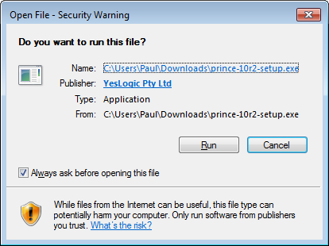
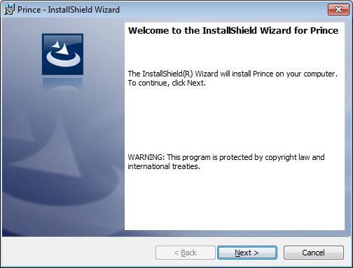
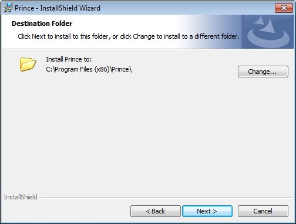
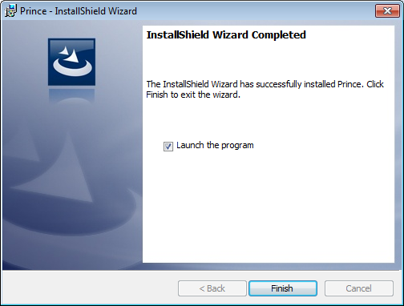
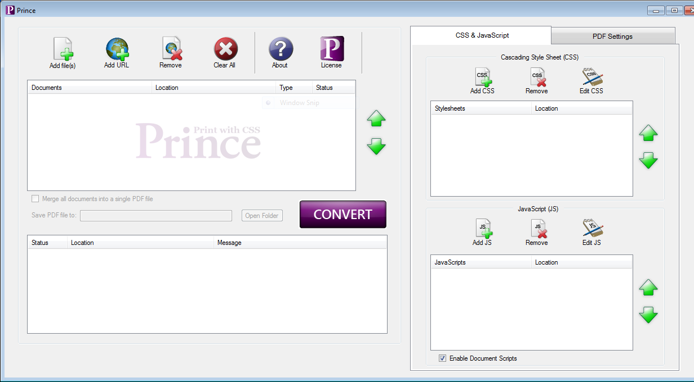
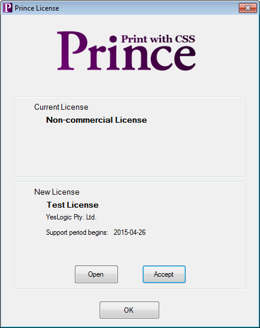

Let's get started with Prince. We will download and install the software and use it to generate a PDF from a very simple document with a very basic stylesheet. This chapter will get you up and running with Prince as quickly as possible.

Readers should already be familiar with HTML and CSS - many good tutorials are available on the topic. Familiarity with your computer's command line interface is desirable but not essential. Because the chapter is aimed at getting started as quickly as possible we may skip some explanations, don't worry as these will be covered later in the manual.

If Prince is already installed, you can directly skip to the [User Guide](intro-userguide).

Installing Prince
-----------------

Prince is available for Windows, MacOS X, Linux (multiple distributions) and FreeBSD. You can download the relevant file from our [downloads page](/download/). For Linux and FreeBSD you may need to choose based on your distribution type, version and processor type (32/64 bits).

Prince is provided under the terms of the [Prince End-User License Agreement](/license/).

### Installing Prince on Windows

1.  Download your installation package from the [Download Page](/download/).
2.  After downloading and attempting to run the installer you might see a confirmation screen like this. Click "run". Note that the filename for the installer may be different than the one shown in the picture.

    Run installer confirmation

    

3.  The installer will display a welcome screen like the one below. Click next.

    Installer welcome screen

    

4.  Next you will need to accept the license agreement. The text of the license agreement is also available [here](/license/). Accept the agreement and click Next.

    Installer license agreement screen

    

5.  Choose the installation directory for Prince. The default is recommended unless you have a specific reason to install Prince elsewhere. When using Prince from the command line we will use the executable in the `Engine\bin\` subdirectory. The installation requires only 16MB of disk space.

    Installation location screen

    

6.  The installation will confirm the installation details with you before performing the installation. Click Next to continue.

7.  After the installation has completed you have the option to launch the Prince graphical user interface (GUI). The Prince graphical user interface is only available for Microsoft Windows. [Your First Document](first-doc.md#first-doc) provides more information about how to use both the GUI and the command line interfaces. Click Finish to close the installer.

    Installation complete

    

To run Prince on Windows, you typically double-click on the Prince icon created during installation. You can also run only the binary, without the GUI, like on all other systems - for details please see the [Command-line Reference](command-line.md#command-line).

For the layout of a Prince installation on Windows, see the [Windows installation layout](#windows-installation-layout) section.

For information about using Prince from PHP, Java, .NET, and other server frameworks you will need to install one or more [Prince wrappers](wrappers.html). See [Server Integration](server-integration.md#server-integration) for installation and usage information.

### Installing Prince on MacOS X

To install Prince on MacOS X, please run the `install.sh` shell script contained in the package downloaded to your computer from the [download page](/download/). This will involve the following procedure:

1.  Open the Terminal application.
2.  Change to the download directory and unpack the downloaded file.
    
        $ cd download_directory
        $ tar xvf prince-package-macosx.zip

3.  Change to the extracted directory.
    
        $ cd prince-package-macosx

4.  Run the installation shell script.
    
        $ ./install.sh

5.  Follow the prompts to install Prince. Please note that you will need to be logged in as root if you wish to install Prince into a system directory such as `/usr/local`, which is the default value. This can be accomplished by running the installation script using `sudo`, which will prompt you for your password:
    
        $ sudo ./install.sh
        Password: .....

If you chose a non-standard location you may need to add the `bin/` subdirectory to your `PATH` environment variable. There are many different types of command interpreters (also called shells), we cannot possibly document all of them. However for Bourne-style shells (the most common type) the command might look like this:

    $ export PATH=/usr/local/myPrinceDir/bin:$PATH

You will need to add the appropriate command to your shell's configuration or startup file. See your distribution or shell's documentation for how to do this.

Prince is now ready to use - to run Prince on MacOS X, enter the `prince` command on the command line - for details please see the [Command-line Reference](command-line.md#command-line). [Your First Document](first-doc.md#first-doc) will walk you through generating your first PDF document.

For the layout of a Prince installation on MacOS X, see the [MacOS X installation layout](#macos-x-installation-layout) section.

For information about using Prince from PHP, Java, .NET, and other server frameworks you will need to install one or more [Prince wrappers](wrappers.html). See [Server Integration](server-integration.md#server-integration) for installation and usage information.

### Installing Prince on Linux/FreeBSD

Prince is installed using the terminal. The installation package can be downloaded from the [Download Page](/download/). Then open a terminal window and change to the directory that you downloaded or copied the installation package to. The `$` symbol represents the command prompt and the text that follows is the command, you should not type in the `$` symbol.

    $ cd download_directory

Depending on your distribution and the package that you downloaded you may be able to install Price using the tools provided by your distribution.

#### Debian and Ubuntu

On Debian and Ubuntu Linux you can use `gdebi` to install Prince and its dependencies. `gdebi` will automatically download and install any package dependencies, therefore it is often easier to use `gdebi` than `dpkg` which will not automatically install dependencies. If you're not logged in as root (and you shouldn't be), then you can use `sudo` to run the `gdebi` command as root.

    $ sudo gdebi prince_package_debian_amd64.deb
    Reading package lists... Done
    Building dependency tree
    Reading state information... Done
    Building data structures... Done
    Building data structures... Done

    formatter for converting XML and HTML into PDF
     This program converts XML and HTML into PDF.
    Do you want to install the software package? [y/N]:y
    Selecting previously unselected package prince.
    (Reading database ... 319168 files and directories currently installed.)
    Preparing to unpack prince_package_debian_amd64.deb ...
    Unpacking prince ...
    Setting up prince ...
    Processing triggers for man-db ...

If `gdebi` is not already installed then you can install it using `aptitude` as follows. `aptitude` cannot be used to install Prince itself as Prince is not available in a Debian repository.

    $ sudo aptitude install gdebi

#### CentOS and Redhat

On RPM based systems, such as CentOS or Redhat Enterprise Linux, you should use the `yum` tool to install Prince. If you're not logged in as root (and you shouldn't be), then you can use `sudo` to run the `yum` command as root.

    $ sudo yum install prince-package.centos.x86_64.rpm

We have not shown all of `yum`'s output here as there is a lot of it. The process should prompt you before installation, which will look similar to:

    ================================================================================
     Package        Arch    Version            Repository                      Size
    ================================================================================
    Installing:
     prince         x86_64  version            /prince-package.centos.x86_64   13 M
    Installing for dependencies:
     fontconfig     x86_64  2.8.0-5.el6        base                           186 k
     giflib         x86_64  4.1.6-3.1.el6      base                            37 k
     libSM          x86_64  1.2.1-2.el6        base                            37 k
     libX11         x86_64  1.6.0-2.2.el6      base                           586 k
     libX11-common  noarch  1.6.0-2.2.el6      base                           192 k
     libjpeg-turbo  x86_64  1.2.1-3.el6_5      base                           174 k
     libtiff        x86_64  3.9.4-10.el6_5     base                           343 k

    Transaction Summary
    ================================================================================
    Install       8 Package(s)

    Total size: 15 M
    Total download size: 1.5 M
    Installed size: 18 M
    Is this ok [y/N]: y
    Downloading Packages:

The process will then end with messages similar to:

    Installed:
      prince.x86_64 0:version

    Dependency Installed:
      fontconfig.x86_64 0:2.8.0-5.el6        giflib.x86_64 0:4.1.6-3.1.el6
      libSM.x86_64 0:1.2.1-2.el6             libX11.x86_64 0:1.6.0-2.2.el6
      libX11-common.noarch 0:1.6.0-2.2.el6   libjpeg-turbo.x86_64 0:1.2.1-3.el6_5
      libtiff.x86_64 0:3.9.4-10.el6_5

    Complete!

Prince is now ready to use. [Your First Document](first-doc.md#first-doc) will walk you through generating your first PDF document.

For information about using Prince from PHP, Java, .NET, and other server frameworks you will need to install one or more [Prince wrappers](wrappers.html). See [Server Integration](server-integration.md#server-integration) for installation and usage information.

#### Tarballs - Alpine Linux, FreeBSD and Generic Linux

Prince can be installed on Alpine Linux and FreeBSD from a *tarball* (a `.tar.gz` file). The tarball packages can also be used on Linux when there is no `.deb` or `.rpm` package for your system or the package for your system didn't work for some reason. In these cases this section contains the relevant installation instructions.

Start by choosing the tarball that is the closest match for your system, take care to match operating system (Linux vs FreeBSD) and processor type (32 vs 64bit - please note that Prince supports only x86 and x86\_64 processors).

The Generic Linux package should be able to run on a wider range of Linux versions than other packages.

These packages rely on some shared libraries installed on your system. Prince is just using the system shared object loader for most libraries, so the `LD_LIBRARY_PATH` environment variable might need to be edited, if you have installed these libraries in different locations.

The `bin/prince` script in the installation directory (see [Linux and FreeBSD installation layout](#linux-and-freebsd-installation-layout)) is a wrapper script that calls the executable, and should be a suitable place to set or modify the `LD_LIBRARY_PATH` variable in order to configure where the loader should look for shared libraries.

To install Prince from a tarball enter these commands.

    $ tar xzf prince-package-freebsd-amd64.tar.gz 
    $ cd prince-package-freebsd-amd64 
    $ sudo ./install.sh 
    Prince

    Install directory
        This is the directory in which Prince will be installed.
        Press Enter to accept the default directory or enter an alternative.
        [/usr/local]: 

    Installing Prince...
    Creating directories...
    Installing files...

    Installation complete.
        Thank you for choosing Prince, we hope you find it useful.
        Please visit http://www.princexml.com for updates and development news.

1.  Start by unpacking the package. Note that the package name may be different than the example shown here. This will create a new directory containing the Prince files.

2.  Change into the new directory unpacked by the package. As before, the directory name may be different from the one in this example.

3.  Run the `install.sh` script. If you want to install Prince for multiple users you may need to execute this command with `sudo` as shown here. `sudo` will execute the given command with \`root' (administrator) privileges. It may prompt you for your password (your user account's password) before executing the command. If you're installing Prince for only one user you can omit `sudo` from this command.

4.  The script will prompt you for the installation directory. You can press enter to accept the default (`/usr/local`) or type in your preferred directory. In this example the user has accepted the default by pressing `ENTER` without entering anything. If you're installing Prince for only one user (and not using `sudo` you will need to choose a directory that you have write access to.

If you chose a non-standard location you may need to add the `bin/` subdirectory to your `PATH` environment variable. There are many different types of command interpreters (also called shells), we cannot possibly document all of them. However for borne-style shells (the most common type) the command might look like this:

    export PATH=/usr/local/prince10/bin:$PATH

You will need to add the appropriate command to your shell's configuration or startup file. See your operating system's or shell's documentation for how to do this.

Prince is now ready to use. [Your First Document](first-doc.md#first-doc) will walk you through generating your first PDF document.

For information about using Prince from PHP, Java, .NET, and other server frameworks you will need to install one or more [Prince wrappers](wrappers.html). See [Server Integration](server-integration.md#server-integration) for installation and usage information.

Installing a license file
-------------------------

If you've purchased Prince you can install your license file (which you will receive via e-mail) to remove the watermark on generated documents. This section will explain how to install the license file. If instead you're using the free version of Prince then you don't need to install a license file.

### Installing a license file on Windows

On Windows you can install a license by following these steps:

1.  Open the license window by clicking the License icon in the main window.

    Click the license button

    

2.  Click the open button and choose your license file.

    License window

    

3.  The license should be displayed in the lower part of the window, click the accept button to install it then click Ok.

    License window with license

    

### Installing a license file on other systems

On other systems copy the `license.dat` file into the `lib/prince/license` directory of the Prince installation (see [Installation Layout](#installation-layout)). For example, if Prince was installed into the default `/usr/local` directory, the license file should be copied to `/usr/local/lib/prince/license/license.dat`

    $ cp license.dat /usr/local/lib/prince/license/license.dat
    $ prince --version
    Prince 10 rev 3
    Copyright 2002-2015 YesLogic Pty. Ltd.
    Test License

Remember to backup your license file in case you want to reinstall Prince in the future.

Installation Layout
-------------------

This section details where Prince installs its files in the various supported operating systems.

### Windows installation layout

Prince installs its files to `%ProgramFiles%` on 32-bit Windows, and to `%ProgramFiles(x86)%` on 64-bit Windows.

-   `prince-gui.exe` is the Prince GUI
-   the subdirectory `engine` contains all resource files

On 64-bit Windows, the Prince GUI is a 32-bit program, but the formatting engine is 64-bit.

In the subfolder `engine` are all resource files:

| Folder    | Function                                                                        |
|-----------|---------------------------------------------------------------------------------|
| `bin`     | The Prince core (`prince.exe`)                                                  |
| `contrib` | Licenses for open source libraries used by Prince                               |
| `dict`    | LibThai dictionary, used by Prince to handle word breaking in the Thai language |
| `dtd`     | Document Type Definitions (DTDs) for XML languages understood by Prince         |
| `etc`     | The CA certificate bundle used for retrieving documents over HTTPS              |
| `hyph`    | The hyphenation dictionaries for common languages                               |
| `icc`     | ICC color profiles                                                              |
| `lib`     | Shared libraries required by Prince                                             |
| `license` | The Prince license file                                                         |
| `math`    | MathML resource files                                                           |
| `style`   | The default CSS style sheets                                                    |

### MacOS X installation layout

Prince installs its files by default to `/usr/local` on MacOS X:

-   `/usr/local/bin/prince` is the shell script
-   `/usr/local/lib/prince/` contains all resource files

In the resource directory are all resource files:

| Folder    | Function                                                                                          |
|-----------|---------------------------------------------------------------------------------------------------|
| `bin`     | The Prince core (the `prince` binary executable) and (as of Prince 11.3) the `princedebug` script |
| `dict`    | LibThai dictionary, used by Prince to handle word breaking in the Thai language                   |
| `dtd`     | Document Type Definitions (DTDs) for XML languages understood by Prince                           |
| `etc`     | The CA certificate bundle used for retrieving documents over HTTPS                                |
| `hyph`    | The hyphenation dictionaries for common languages                                                 |
| `icc`     | ICC color profiles                                                                                |
| `lib`     | Shared libraries required by Prince                                                               |
| `license` | The Prince license file                                                                           |
| `math`    | MathML resource files                                                                             |
| `style`   | The default CSS style sheets                                                                      |

### Linux and FreeBSD installation layout

Prince installs its files by default to `/usr` on Linux and FreeBSD:

-   `/usr/bin/prince` is the shell script
-   `/usr/lib/prince/` contains all resource files

In the resource directory are all resource files:

| Folder    | Function                                                                                          |
|-----------|---------------------------------------------------------------------------------------------------|
| `bin`     | The Prince core (the `prince` binary executable) and (as of Prince 11.3) the `princedebug` script |
| `dict`    | LibThai dictionary, used by Prince to handle word breaking in the Thai language                   |
| `dtd`     | Document Type Definitions (DTDs) for XML languages understood by Prince                           |
| `etc`     | The CA certificate bundle used for retrieving documents over HTTPS                                |
| `hyph`    | The hyphenation dictionaries for common languages                                                 |
| `icc`     | ICC color profiles                                                                                |
| `lib`     | Shared libraries required by Prince                                                               |
| `license` | The Prince license file                                                                           |
| `math`    | MathML resource files                                                                             |
| `style`   | The default CSS style sheets                                                                      |

