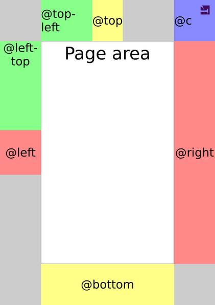
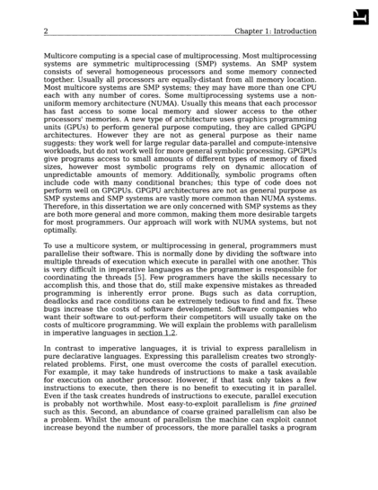
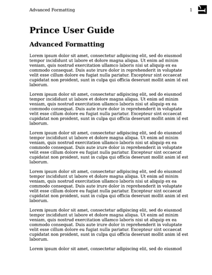
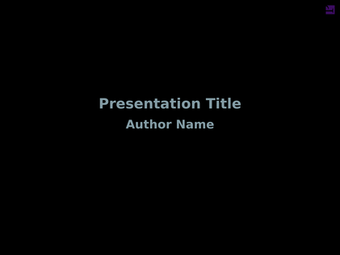
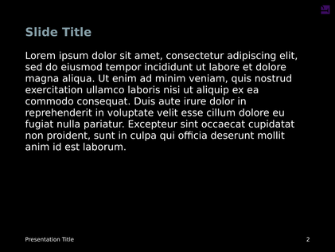
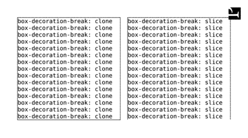

Prince produces PDFs - which are a prominent example of paged media. There are a few differences that are crucial to keep in mind when preparing a document for paged media intended for print:

<dl>
  <dt>Pagination</dt>
  <dd><p>The major difference between formatting for the web and for PDF/Print is that
  PDF is paginated, i.e. the content is placed on discrete pages.  Pages have a defined
  <a href="/doc/paged#page-size">size</a> and content can be laid out in a specific
  pattern making use of predefined <a href="/doc/paged#page-regions">page regions</a>.
  Elements can not only be floated right and left, but they can also be floated to
  the top and bottom of the page, or of a column, or the float even can be
  deferred to the next page (see <a href="/doc/styling#prince-extensions-to-floats">Prince extensions to floats</a>).
  Pages can be <a href="/doc/paged#selecting-pages">selected</a> and
  <a href="/doc/paged#named-pages">named</a>, which allows for specific treatment of
  certain pages.  Also, it is important to have an understanding of
  <a href="/doc/paged#controlling-pagination">pagination</a>: content might not fit
  on a page and might spill over into the next page, or it might be necessary
  to move it to the next page in order to avoid creating gaps (see
  also <a href="/doc/styling#conditional-modifiers">Conditional modifiers</a>).</p></dd>

  <dt>Page spreads</dt>
  <dd><p>A basic unit for paged media in print is the page spread: the left page, called
  <i>verso</i> in a left-to-right script (see <a href="/doc/styling#writing-mode">Writing Mode</a>), and
  the right page, called <i>recto</i>, are of the same size and typically are
  symmetrical to each other and are centered on the gutter.  Selected and named
  pages can be placed <i>recto</i> or <i>verso</i>, and Prince expands several
  properties and the <a href="/doc/css-at-rules#at-page"><code>@page</code></a>
  at-rule pseudo-classes with the values <code>verso</code> and <code>recto</code>, or
  <code>inside</code> and <code>outside</code>, referring to the layout on each
  page of the spread.</p></dd>

  <dt>Non-interactive</dt>
  <dd><p>Last but not least, paged media intended for print is non-interactive by nature.
  All CSS properties referring to user interaction make no sense, scripting cannot
  be interactive and scripts need to run before layout is finished.  But for these
  details and scripting after layout please check the section on <a href="/doc/javascript#javascript-in-printed-media">JavaScript in Printed Media</a>.</p></dd>
</dl>

Prince allows you to control a number of options that affect how to format pages, from straight-forward options such as [page size](#page-size), to [page style](#page-style), [page regions](#page-regions) like headers and footers, [pagination control](#controlling-pagination) and [page numbering](gen-content.md#counters-and-numbering).

CSS properties that affect pages are specified within page *at-rules* (see [CSS At-rules](css-at-rules.md)). For example, we can use the [`size`](css-props.md#prop-size) property within the [`@page`](css-at-rules.md#at-page) rule to specify the page size (see [Page size](#page-size)).

```
    @page {
        size: A4
    }
```
In this section we will show most of the properties that can be specified within a page rule, then we will show how pagination can be controlled and how page styles can be applied to selected pages.

The initial values for CSS properties are defined internally - these are the initial `@page` styles:

```
    @page {
        margin: 54pt;
        -prince-bleed: auto /* '6pt' if marks present */ ;
        -prince-trim: auto /* '57pt 48pt' if marks present */ ;
        marks: none;
        -prince-mark-length: 24pt;
        -prince-mark-width: 0.1pt;
        -prince-mark-offset: auto /* equal to prince-bleed */ ;
        size: Letter;
        -prince-pdf-page-colorspace: auto;
        -prince-pdf-page-label: auto;
        -prince-rotate-body: 0deg;
        -prince-shrink-to-fit: none;
    }
```


## Page size

Page size can be specified using the [`size`](css-props.md#prop-size) property in *length* units or by a page size keyword (see [Page Size Keywords](page-size-keywords.md) for a list), optionally combined with the `portrait` or `landscape` keyword.


```
    /* Use A4 paper */
    @page { size: A4 }

    /* Use A4 paper in landscape orientation */
    @page { size: A4 landscape }

    /* These two custom sizes are equivalent */
    @page { size: 30cm 40cm }
    @page { size: 40cm 30cm landscape }

    /* Use square paper, this sets width and height */
    @page { size: 30cm }
```
Sometimes it can be useful to specify the page dimensions in pixels, for example when creating presentation slides (see the [Presentation slides example](#fig-slides)).

```
    @page {
        size: 1280px 960px;
    }
```
## Page style

Pages, like other block level elements, follow the CSS box model introduced in [Box Model](styling.md#box-model). Their `margin`, `border`, `padding` and `background` can be styled within [`@page`](css-at-rules.md#at-page) rules.

The [`@page`](css-at-rules.md#at-page) rules can only style the page and its margin boxes - it cannot contain style rules to target specific elements, but it can contain at-rules to target the page regions (for a complete list of possible at-rules, see [Page regions](#page-regions)).

```
    @page {
        margin: 2cm;
    }
```
Prince also supports the `margin-outside` and `margin-inside` properties. These allow you to specify different margins for the inside and outside edges of paper as it is bound into a book. For example it may be necessary to have a larger inside margin (called a *gutter*) so that after some of the margin is used by the binding, the remaining margins are even.

```
    @page {
        margin: 2cm;
        margin-inside: 3cm;
    }
```
This is used in [Fancy headers](#fig-fancyheader).

## Page regions



Most content appears inside the *page area* of one or more pages - in the above figure the *page area* is marked with a solid black border.  Surrounding the page area is the margin area, which contains the *page-margin boxes*.  Other special areas are overlaying the *page area*, or are placed at its left, or right side, or at its top, or bottom.  Collectively, they are known as the *page regions*.

The figure above shows the position of some *page-margin boxes*, which can be used for creating running page headers and footers, as well as some common regions in the main *page area*.

The [`@page`](css-at-rules.md#at-page) background is lightgrey and the body's, i.e. the *page area*'s background is white.

You can place content in a page-margin box with the [`content`](css-props.md#prop-content) property.  The areas inside the page area, however, do not take generated content.

For example, you can print the current page number at the bottom of each page (see [Generated Content](gen-content.md)):

```
    @page {
        @bottom-center {
            content: counter(page)
        }
    }
```
Two examples in [the next chapter](#selecting-pages) show examples of page headers and footers:

-   the [Novel title page example](#fig-titlepage) creates a footer to display the page number, but suppresses it for the title page; and
-   the [Textbook page numbers example](#fig-textbook) displays a more complex use of headers by placing the book title in the header of left pages, and the current chapter's title in the header of right-facing pages, in addition to the page number.

Several other page regions can also be used. The full list of page regions is shown in the [Page regions](#tab-marginboxes) table.

<p id="tab-marginboxes">Page regions</p>

<table class="grid" id="pregions">
<thead>
<tr>
<th/>
<th>Name</th>
<th colspan="2">Default alignment</th>
<th>In figure</th>
</tr>
<tr>
<th/>
<th/>
<th><code><a href="/doc/css-props#prop-text-align">text-align</a></code></th>
<th><code><a href="/doc/css-props#prop-vertical-align">vertical-align</a></code></th>
<th/>
</tr>
</thead>
<tbody>
<tr>
<td></td>
<td><b><i>Page area</i></b></td>
<td>start</td>
<td>baseline</td>
<td style="border: 3px black solid;">solid black border</td>
</tr>
</tbody>
<tbody>
<tr>
<td rowspan="16">Page-margin boxes</td>
<td><code>@top-left</code></td>
<td>left</td>
<td>middle</td>
<td style="background-color: lightgreen">lightgreen</td>
</tr>
<tr>
<td><code>@top-center</code></td>
<td>center</td>
<td>middle</td>
<td style="background-color: lemonchiffon">lemonchiffon</td>
</tr>
<tr>
<td><code>@top-right</code></td>
<td>right</td>
<td>middle</td>
<td>not shown</td>
</tr>
<tr>
<td><code>@bottom-left</code></td>
<td>left</td>
<td>middle</td>
<td>not shown</td>
</tr>
<tr>
<td><code>@bottom-center</code></td>
<td>center</td>
<td>middle</td>
<td style="background-color: lemonchiffon">lemonchiffon</td>
</tr>
<tr>
<td><code>@bottom-right</code></td>
<td>right</td>
<td>middle</td>
<td>not shown</td>
</tr>
<tr>
<td><code>@left-top</code></td>
<td>center</td>
<td>top</td>
<td style="background-color: lightgreen">lightgreen</td>
</tr>
<tr>
<td><code>@left-middle</code></td>
<td>center</td>
<td>middle</td>
<td style="background-color: lightcoral">lightcoral</td>
</tr>
<tr>
<td><code>@left-bottom</code></td>
<td>center</td>
<td>bottom</td>
<td>not shown</td>
</tr>
<tr>
<td><code>@right-top</code></td>
<td>center</td>
<td>top</td>
<td>not shown</td>
</tr>
<tr>
<td><code>@right-middle</code></td>
<td>center</td>
<td>middle</td>
<td style="background-color: lightcoral">lightcoral</td>
</tr>
<tr>
<td><code>@right-bottom</code></td>
<td>center</td>
<td>bottom</td>
<td>not shown</td>
</tr>
<tr>
<td><code>@top-left-corner</code></td>
<td>right</td>
<td>middle</td>
<td>not shown</td>
</tr>
<tr>
<td><code>@top-right-corner</code></td>
<td>left</td>
<td>middle</td>
<td style="background-color: cornflowerblue">cornflowerblue</td>
</tr>
<tr>
<td><code>@bottom-left-corner</code></td>
<td>right</td>
<td>middle</td>
<td>not shown</td>
</tr>
<tr>
<td><code>@bottom-right-corner</code></td>
<td>left</td>
<td>middle</td>
<td>not shown</td>
</tr>
<tr>
</tbody>
<tbody>
<td rowspan="8">Page area regions</td>
<td><code>@page-float-top</code></td>
<td>center</td>
<td>top</td>
<td style="background-color: lightblue">lightblue</td>
</tr>
<tr>
<td><code>@page-float-bottom</code></td>
<td>center</td>
<td>bottom</td>
<td style="background-color: gainsboro">gainsboro</td>
</tr>
<tr>
<td><code>@prince-overlay</code></td>
<td>center</td>
<td>middle</td>
<td style="background: repeating-linear-gradient( -45deg, rgba(255,255,255, 0.1), rgba(255,255,255, 0.1) 10px, rgba(255,0,0, 0.2) 10px, rgba(255,0,0, 0.2) 20px );">stripes</td>
</tr>
<tr>
<td><code>@footnote</code></td>
<td>left</td>
<td>middle</td>
<td style="background-color: aliceblue">aliceblue</td>
</tr>
<tr>
<td><code>@leftnote</code></td>
<td>left</td>
<td>middle</td>
<td style="background-color: pink">pink</td>
</tr>
<tr>
<td><code>@rightnote</code></td>
<td>left</td>
<td>middle</td>
<td style="background-color: thistle">thistle</td>
</tr>
<tr>
<td><code>@outsidenote</code></td>
<td>left</td>
<td>middle</td>
<td>not shown</td>
</tr>
<tr>
<td><code>@insidenote</code></td>
<td>left</td>
<td>middle</td>
<td>not shown</td>
</tr>
</tbody>
</table>

<dl>
  <dt>Page-margin boxes</dt>
  <dd><p>Prince will try to create <em>page-margin boxes</em> of the correct sizes. If you
  need to create boxes of specific sizes you may need to use only a single box (eg:
  <code>@top-center</code>) and use the <a href="/doc/css-props#prop-content"><code>content</code></a> property to place elements with specific sizes in it.</p>
  <p>Note that in the above <a href="#page-regions">Page regions</a> figure, Prince leaves
  space for <code>@top-right</code> and <code>@left-bottom</code> boxes because their
  counterparts (<code>@top-left</code> and <code>@left-top</code> respectively) have been
  defined. This keeps the <code>@top-center</code> and <code>@left-middle</code> centered
  along the top and side of the page respectively.</p>
  <p>The page-margin boxes <code>@top-center</code>, <code>@top-left</code> or <code>@top-right</code> can be used to create running page headers, and the page-margin boxes <code>@bottom-center</code>, <code>@bottom-left</code> or <code>@bottom-right</code> are useful for page footers (see <a href="/doc/cookbook#page-headers-and-footers">Page Headers and Footers</a>).</p>
  </dd>

  <dt>Page area regions</dt>
  <dd><p>The <em>page area</em> itself has a few special regions that can be addressed with
  specific at-rules: to the left and right are two sidenote regions (<code>@leftnote</code>
  and <code>@rightnote</code>), and at the top and bottom of the remaining space are two more
  regions (<code>@page-float-top</code> and <code>@page-float-bottom</code>).  Below all these,
  there is the footnote area.</p>
  <p>The page region <code>@prince-overlay</code> is a special region, overlaying all of the
  page area. A typical use is for creating watermarks on all pages of the document (see
  <a href="/doc/cookbook#watermarks">Watermarks</a>).</p>
  <p>The page region <code>@footnote</code> is placed by default at the foot of the page area
  and contains the footnotes (see <a href="/doc/styling#footnotes">Footnotes</a>). Note that
  if there are no footnotes on a page, the footnote area will not be displayed on that page at
  all.</p>
  <p class="note">The <code>@footnote</code> area can be positioned other than its default
  position (see <a href="/doc/styling#styling-and-behavior-of-footnotes">Styling and behavior
  of footnotes</a> and <a href="/doc/cookbook#sidenotes">Sidenotes</a>). All other page
  regions cannot be moved - their position is defined by the page margins, or their position
  in the page area.</p>
  <p>The <code>@leftnote</code> and <code>@rightnote</code> areas for sidenotes are placed
  left and right of the page area and contain the sidenotes (see
  <a href="/doc/styling#sidenotes">Sidenotes</a>).  For page spreads, there are also at-rules
  for <code>@outsidenote</code> and <code>@insidenote</code>.  The sidenote areas need a width
  to be defined.</p>
  </dd>
</dl>

Many CSS properties can be applied to page regions:

-   The height of the top and bottom page-margin boxes, as well as the width of the left and right page-margin boxes is defined by the [`margin`](css-props.md#prop-margin) values of the page style given in a `@page` rule (see [Page style](#page-style) for more details).

-   All of the [`margin`](css-props.md#prop-margin), [`border`](css-props.md#prop-border), [`padding`](css-props.md#prop-padding) and [`background`](css-props.md#prop-background) properties can be used to style page regions.

-   The [`vertical-align`](css-props.md#prop-vertical-align) property can be applied to any page region to vertically align its content.

-   When a page region contains generated content, many inline style properties such as [`color`](css-props.md#prop-color) and [`font`](css-props.md#prop-font) can be applied to style the generated content.

### Generated content in page regions

We have already shown an example of using the `page` counter to print the page number at the bottom of each page, this is one example of generated content. The `page` counter is predefined and starts at 1; it increments automatically for each new page. (Note that the page counter cannot be incremented manually using the [`counter-increment`](css-props.md#prop-counter-increment) property.)

The `page` counter can be reset using the [`counter-reset`](css-props.md#prop-counter-reset) property at any block-level element within a non-floating element in the normal flow. This is useful for restarting page numbering at a new section of the document.

<p id="fig-restart-page-numbers">Restarting page numbering</p>

HTML
```html
    <body>
        <div class="front"> cover page, etc, ... </div>
        <div class="contents">
            table of contents, ...
        </div>
        <div class="body">
        <div class="chapter"> chapter 1...</div>
        <div class="chapter"> chapter 2...</div>
        </div>
        <div class=appendix"> appendix1 </div>
        <div class=appendix"> appendix2, ... </div>
    </body>
```
CSS
```css
    .contents {
        display: block;
        page: table-of-contents;
        counter-reset: page 1
    }
    @page table-of-contents {
        @top-center {
            content: "Table of Contents"
        }
        @bottom-center {
            content: counter(page, lower-alpha)
        }
    }
    .body {
        display: block;
        page: main;
        counter-reset: page 1
    }
    @page main {
        @top-center {
            content: string(chapter-title)
        }
        @bottom-center {
            content: counter(page)
        }
    }
    .chapter h1 {
        string-set: chapter-title content()
    }
```

This example also uses [Named pages](#named-pages) which we will explain in more detail below. We create three types of pages: table-of-contents pages, main pages, and pages without a name.

The .contents rule names the pages that it appears on as table-of-contents and resets the page counter to 1 at the start of the contents div. Then the [`@page`](css-at-rules.md#at-page) rule for those pages generates a page footer that contains the current page number in `lower-alpha` style. This rule also sets the page header to the string "Table of Contents".

The `.body` rule names the pages that it appears on as main and resets the page counter to 1 at the start of main div. Then the [`@page`](css-at-rules.md#at-page) rule for the main pages generates a page footer that contains the current page number in the default decimal style. This rule, together with the .chapter h1 rule, sets the page header to the title of the chapter.

Pages that don't match either of these names have the default style, which does not include a page number in the footer.

In some documents, particularly those that are unbound such as office documents, it can be useful to show the total number of pages on each page. The total number of pages can be accessed using the `pages` counter. This is a pre-defined counter that is fixed to the total number of pages in the document.

```
    @page {
        @bottom-center {
            content: "Page " counter(page) " of " counter(pages)
        }
    }
```
This rule will generate page footers such as "Page 1 of 89".

<p id="fig-fancyheader">Fancy header example</p>


This example shows a header as might be found in a textbook. The [HTML](assets/samples/fancyheader.html) and [PDF](assets/samples/fancyheader.pdf) are both available. This is a small part of a [larger example](https://github.com/yeslogic/prince-samples/tree/master/thesis) in our [Prince samples repository](https://github.com/yeslogic/prince-samples).

Fancy headers

This example demonstrates a more complete headers style. It uses generated content to print page numbers, the chapter number and title and the section number and title using different styles for left and right pages. It also prints an underline under the header.

```
    @page {
        font-family: Times, Serif;
        font-size: 11pt;
        text-align: justify;
        margin-top: 2cm;
        margin-bottom: 2cm;
        margin-inside: 3.5cm;
        margin-outside: 2.5cm;
    }

    @page body:left {
        @top-left {
            content: counter(page);
            vertical-align: bottom;
        }
        @top-right {
            content: "Chapter " counter(chapter) ": " string(chapter);
            vertical-align: bottom;
        }
    }
    @page body:right {
        @top-right {
            content: counter(page);
            vertical-align: bottom;
        }
        @top-left {
            content: counter(chapter) "." counter(section) " "
                string(section);
            vertical-align: bottom;
        }
    }
    @page body {
        border-top: thin black solid;
    }
    @page body:first {
        margin-top: 25%;
        @top-left { content: normal; }
        @top-right { content: normal; }
        border: none;
    }
    @page body:blank {
        @top-left { content: normal; }
        @top-right { content: normal; }
        border: none;
    }
    body {
        font-family: Times, Serif;
        font-size: 11pt;
        text-align: justify;
        padding: 0.5cm 0cm;
    }

    div.body {
        page: body;
    }

    div.body h1 {
        break-before: right;
        -prince-page-group: start;
        string-set: chapter content();
        counter-increment: chapter;
        counter-reset: section;
    }
    div.body h1::before {
        content: "Chapter " counter(chapter) ": ";
    }

    div.body h2 {
        string-set: section content();
        counter-increment: section;
    }
    div.body h2::before {
        content: counter(chapter) "." counter(section) " ";
    }
```
The main content area is 2.5cm from the page's edge on all sides. On the left and right this is a margin of 2.5cm and on the top and bottom it's 2cm of margin and 0.5cm of padding. This places the bottom border of the `@top` page region 0.5cm from the main content area, enough to avoid making it look crowded. The header text has the `vertical-align: bottom` property to ensure that it appears immediately above the border — the border is made to look like an underline. This example uses many properties and page selectors discussed later in this section. This is a small part of a [larger example](https://github.com/yeslogic/prince-samples/tree/master/thesis) in our [Prince samples repository](https://github.com/yeslogic/prince-samples).

### Copying content from the document

Generated content in page regions may contain text content copied from the document using the [`string-set`](css-props.md#prop-string-set) property:

CSS

```
    @page {
        @top-center {
            content: string(doctitle)
        }
    }

    h1 { string-set: doctitle content() }
```
The `@page` rule specifies that the top-center page region will contain the text content of the document title copied from the text content of the `h1` element in the document.

The second argument to the `string()` function is a `page-policy` (see [The optional `page-policy` value](gen-content.md#the-optional-page-policy-value)).

For a dictionary, you might want to have a page header that says "a-af", where "a" is the first definition on the page and "af" is the last, so you apply `string-set` for each definition, and then you can select the `first` and `last` one with a page policy in the page header.

```
    @page {
      @top-left { content: string(term, first);}
      @top-right { content: string(term, last);}
    }
```
The page policy value `first-except` is equivalent to `start`, *unless* the `string-set` is applied on the current page, in which case it will return *no* value.

This can be very useful as a means to repeating the title of a chapter as a page heading in the `@top-center` page region, without duplicating the information on the page where the heading appears in the running text of the page.

```
    @page {
      @top-center { content: string(letter, first-except);}
    }
```
You can see these examples in full action in the [Dictionary](/samples/#dictionary) sample ([HTML](http://css4.pub/2015/icelandic/dictionary.html) - [PDF](http://css4.pub/2015/icelandic/dictionary.pdf)).

### Taking elements from the document

Page region content may also be taken from the document itself. Any block-level element can be removed from the normal flow and placed in a page region. It will normally inherit from its original position in the document, but does not display there. Please also note the following:

-   All `margin` properties of an element not in the natural document flow will be ignored.
-   The first running element that appears on a page will be used on the current page and carried onto following pages, until a new running element is encountered.

To move the content into a page region, the element needs to be removed from the normal document flow position with the `running()` function of the [`position`](css-props.md#prop-position) property, and inserted into the specified region with the `element()` function of the [`content`](css-props.md#prop-content) property.

CSS

```
    @page {
        @top-center { content: element(header) }
    }
    h1 { position: running(header) }
```
The `@page` rule specifies that the top page region is a new running header named "header".

The rule for the `h1` element moves it to the "header" running element, removing it from the default normal flow.

Prince also provides another interface for creating running headers: the content can be removed from the normal flow with `-prince-flow: static()`, to be placed in a page region with `content: flow()`.

CSS

```
    @page {
        @bottom-center { content: flow(footer) }
    }
    footer { -prince-flow: static(footer, start) }
```
In addition to the standard mechanism, the Prince specific one offers an extra feature that might be useful in certain scenarios: the `static()` function accepts an optional `start` argument, which makes the fetched content available, as if it were fetched from the start of the document. An example to clarify:

Many HTML documents designed for browsers have the following structure:

```html
    <header>
    main content
    <footer>
```
Unfortunately, if you want to place the footer element in the page footer, it will only appear on the last page - because it is at the end of the document! To solve this, the document must be modified to look like this:

```html
    <header>
    <footer>
    main content
```
It can be achieved by using JavaScript to move the element, but the simple `start` keyword on the [`-prince-flow`](css-props.md#prop-prince-flow) property instructs Prince to pretend that the element was seen at the beginning of the document.

The `element()` and `flow()` functions replace the entire margin box, and cannot be combined with other content. If you just want to capture some text from the document, use named strings instead (see [Copying content from the document](#copying-content-from-the-document)) - they can be combined with other content.

## Selecting pages

It is often necessary to apply styles to some pages, but not others. Either applying them to only some pages, or on every page *except* selected pages. CSS and Prince provide a number of *page selectors* for choosing which pages a rule applies to.

In a novel it is useful to print a page number at the bottom of every page, *except* for some pages such as the title page. In this example the [`@page`](css-at-rules.md#at-page) rule is applied to all pages. Then the `@page:first` rule, which is more specific, removes the footer from the first page. See [Page regions](#page-regions) and [Generated Content](gen-content.md).

<p id="fig-titlepage">Novel title page example</p>


A title page example showing use of `@page:first`. Download the [PDF](assets/samples/titlepage.pdf) or the [HTML](assets/samples/titlepage.html).

```html
    <html>
    <head>
    <style>
    @page {
        @bottom-center {
            content: counter(page)
        }
    }
    @page:first {
        margin-top: 10cm;
        @bottom-center {
            content: normal
        }
    }
    h1, h2.subtitle {
        text-align: center
    }
    h2.chaptertitle {
        break-before: page
    }
    </style>
    </head>
    <body>

    <h1>The Magnificent Octopus</h1>
    <h2 class="subtitle">S. Baldrick</h2>

    <h2 class="chaptertitle">Chapter 1</h2>
    <p>Once upon a time there lived a little saussage.</p>

    </body>
    </html>
```
In this example the [`@page`](css-at-rules.md#at-page) rule specifies styles that apply to all pages: Then the `@page:first` rule overrides this for the first page only. It resets the [`content`](css-props.md#prop-content) property for the footer and increases the top margin, printing the title of the novel in a reasonable place on the page (see [Page style](#page-style)). This example also uses the [`break-before`](css-props.md#prop-break-before) property to force a page break (see [Page breaks](#page-breaks)).

When using the `:first` page selector to choose the first page in each chapter (such as in [Fancy headers](#fig-fancyheader)) it may be necessary to add `-prince-page-group: start` to the first element in each chapter (such as `h1`). See [Page groups](#page-groups).

The `:left` and `:right` page selectors can be used to style left and right pages in a bound book differently. This is often used in text books to place the page number on the outside top corners of pages.

Alternatively, the `:recto` and `:verso` selectors can be used, with the advantage of being independent of directionality of the script: in a left-to-right script, `:recto` is the right-hand side of a spread, and `:verso` is the left-hand side, while in a right-to-left script these values are inverted: `:recto` defines the left-hand side of a spread, and `:verso` defines the right-hand side. See also [Writing Mode](styling.md#writing-mode).

<p id="fig-textbook">Textbook page numbers example</p>


A text book example showing use of `@page:left` and `@page:right`. Download the [PDF](assets/samples/textbook.pdf) or the [HTML](assets/samples/textbook.html).

```css
    @page:left {
        @top-left { content: counter(page) }
        @top-right { content: string(book-title) }
        margin-left: 2cm;
        margin-right: 3cm;
    }
    @page:right {
        @top-left { content: string(chapter-title) }
        @top-right { content: counter(page) }
        margin-left: 3cm;
        margin-right: 2cm;
    }

    h1 { string-set: book-title content() }
    h2 { string-set: chapter-title content() }
```
These rules also place the book title in the header of left pages, and the current chapter's title in the header of right-facing pages. The book title is copied from the text content of the `h1` element while the chapter title is copied from the text content of the `h2` elements (see [Generated Content](gen-content.md)). They also specify wider margins in the *gutter* of the page spread; binders may need this extra width for a book's binding.

The first page in a document using the default left-to-right reading order is a right page. Imagine the cover or a title page of a book which appear on a right page. The first page of a right-to-left document is a left page.

By putting `break-before: left` or `right` at the very beginning of the document, it will not leave a blank page, but instead will change whether the document begins on a left or right facing page.

Sometimes it can be useful to select the *N*th page in a document. The `:nth(N)` page selector can be used to do this:

```css
    @page:nth(42) {
        ...
    }
```
### Named pages

Sometimes it is necessary to style pages depending on their content; named pages allow us to select pages that contain particular elements. We used this in [Restarting page numbering](#fig-restart-page-numbers), to apply a style to the table of contents pages to print their page numbers using roman numerals.

The element containing the table of contents has a [`page`](css-props.md#prop-page) property applied, specifying that this element's pages are table-of-contents pages. The [`page`](css-props.md#prop-page) property may be applied to any block-level element within a non-floating environment in the normal flow.

```css
    .contents {
        display: block;
        page: table-of-contents;
    }
```
Then using this page name to apply a different [`@page`](css-at-rules.md#at-page) rule to the table-of-contents pages:

```css
    @page table-of-contents {
        @top-center { content: "Table of Contents" }
        @bottom-center {
            content: counter(page, lower-alpha)
        }
    }
```
More than one element can *belong* to the same name, in other words, page names behave like CSS classes.

Prince will create a page break between elements belonging to different named pages, including elements without a named page. So in [Restarting page numbering](#fig-restart-page-numbers), a page break will be inserted after the the table of contents, because the next element has the page name main rather than table-of-contents.

Selectors such as `:first`, `:Nth`, `:left` and `:right` also work with named pages. For example:

```css
    @page preface {
        @bottom-center {
            content: counter(page, lower-alpha)
        }
    }
    @page preface:first {
        @bottom-center {
            content: normal;
        }
    }
```
This example only works when a page name is used only once within a document, such as for the preface of a document (documents only have one preface). If you wish to apply a style to the first page of every chapter then you must use the [`-prince-page-group`](css-props.md#prop-prince-page-group) property to create *page groups*:

```
    div.chapter {
        page: chapter;
        break-before: right;
        -prince-page-group: start;
    }
    @page chapter {
        @bottom-center {
            content: counter(page);
        }
    }
    @page chapter:first {
        @bottom-center {
            content: normal;
        }
    }
```
The property `-prince-page-group: start` instructs Prince to start a new page group. This is necessary for the `div.chapter:first` selector to match the first page of each chapter, instead of only the first page in the first chapter. See [Page groups](#page-groups).

### Blank pages

A special case are blank pages.

As we discussed in the previous section, `break-before: right` can be used to place the first page of a chapter on the right page in a spread. If the previous page is a right page, two page breaks are inserted, leaving a blank left page. However, this page will have normal [`@page`](css-at-rules.md#at-page) styles applied to it, which is usually not what people want. The `:blank` page selector can be used to change the style of blank pages, pages skipped such as a left page before a `break-before: right`, including removing any content.

```css
    @page:left {
        @top-left {
            content: counter(page);
        }
    }
    @page:right {
        @top-right {
            content: counter(page);
        }
    }

    @page:blank {
        @top-left {
            content: normal;
        }
        @top-right {
            content: normal;
        }
    }

    h1 {
        break-before: right;
    }
```
This example clears the generated content used on these pages. This works because `:blank` is more specific than either `:left` or `:right`. The `:blank` page selector can also be used with named pages.

```css
    @page frontmatter {
        @bottom-center { content: counter(page, lower-roman); }
    }

    @page frontmatter:blank {
        @bottom-center { content: normal; }
    }
```
If chapter 1 also resets page numbering, then the page numbers will be reset on the first *content page*, i.e. a non-blank page.

<p class="note">
It is not always desirable to have no content on blank pages. Sometimes otherwise blank pages are required have some content, such as a notice saying "This page intentionally left blank". For example, in legal documents, this prevents people from mistaking a dangerous printing error for an intentionally blank page.
</p>

### Page groups

When consecutive elements belong to the same named page but logically separate structures (such as individual chapters) Prince combines them into one *page group*. This causes it to apply the `:first` page selector to the first page of the whole page group only (the first page of chapter 1). Instead we usually want `:first` applied to the first page of each chapter.

This can happen either:

-   when chapters are separated by an element, such as `h1` which may have `break-before: right` applied (this can be seen in [Fancy headers](#fig-fancyheader));
-   or when each chapter is a block element such as a `div`.

Prince provides the [`-prince-page-group`](css-props.md#prop-prince-page-group) property that can be used to start a new page group. It can be seen in [Fancy headers](#fig-fancyheader) applied to h1 elements in the body of the document.

```
    div.body h1 {
        break-before: right;
        -prince-page-group: start;
        ...
    }
```
`-prince-page-group` also forces a page break, overriding any properties that attempt to avoid page breaks. The more specific `left` and `right` page take precedence over `-prince-page-group`.

## Controlling pagination

Prince will create page breaks automatically when new content will not fit on a page. Sometimes it is useful or necessary to control where page breaks should and should not be used. There are two ways to do this, and both are useful in different circumstances: page breaks can be added or prohibited with the [Page breaks](#page-breaks) properties, and you can control where, within a paragraph, a page break may occur with the [Widows and orphans](#widows-and-orphans) properties.

### Page breaks

The simplest case is when you want to explicitly create a page break. This is typically used at the beginning of a chapter, to start the new chapter on a new page.

```
    h1 {
        break-before: page;
    }
```
The property [`break-before`](css-props.md#prop-break-before) is used to force a page break immediately before an `h1` element. New chapters are often started on the *recto* pages in text books, this is usually the right page:

```
    h1 {
        break-before: right
    }
```
Please note that by putting `break-before: left` or `right` at the very beginning of the document, it will not leave a blank page, but instead will change whether the document begins on a left or right facing page.

Other values are `auto`, `avoid`, `avoid-page`, `avoid-column`, `left`, as well as `recto`, `verso` and `column`.

The previous example could therefore also have been written in the following, more semantic (and possibly more flexible) way:

```
    h1 {
        break-before: recto
    }
```
The property [`break-after`](css-props.md#prop-break-after) may also be used to force a page break after an element.

<p id="fig-slides">Presentation slides example</p>

 
Two overhead slides for a presentation. The slides use white on black for better contrast on most projectors, and a 4x3 aspect ratio. Download the [PDF](assets/samples/slide.pdf) or the [HTML](assets/samples/slide.html) and [CSS](assets/samples/slide.css).

It is necessary to force a page break when creating overhead slides. This can be done by placing the content for each slide in a `<div class="slide">` and using `break-before: page` as shown below. This example shows other styling that may be required to create presentation slides.

CSS

```css
    @page {
        size: 1280px 960px;
        @bottom-left {
            content: "Presentation Title";
        }
        @bottom-right {
            content: counter(page);
        }
        background: black;
        color: white;
        font-family: DejaVu Sans, sans-serif;
        font-size: 16pt;
        margin: 96px;
    }

    @page:first {
        @bottom-left { content: normal }
        @bottom-right { content: normal }
    }

    div.centerpage {
        /*
         * Cause the content on these pages to begin part-way through
         * the page. This is useful for a title page.
         */
        margin-top: 33%;
    }

    body {
        font-size: 28pt;
        font-family: DejaVu Sans, sans-serif;
        color: white;
    }

    div.slide {
        break-before: page;
    }
```
HTML

```html
    <div class="slide">
      <h2>Slide Title</h2>

      <p>
        Lorem ipsum dolor sit amet, consectetur adipiscing elit, sed do
        eiusmod tempor incididunt ut labore et dolore magna aliqua. Ut enim
        ad minim veniam, quis nostrud exercitation ullamco laboris nisi ut
        aliquip ex ea commodo consequat. Duis aute irure dolor in
        reprehenderit in voluptate velit esse cillum dolore eu fugiat nulla
        pariatur. Excepteur sint occaecat cupidatat non proident, sunt in
        culpa qui officia deserunt mollit anim id est laborum.
      </p>
    </div>
```
The `font-family` and `color` properties are specified both in the `@page` and `body` rules, even though they're the same. This is required because the page regions are outside of the `body` and must be styled separately, likewise the content within `body` cannot be styled by the `@page` rule.

A rendered slide for this example is shown in [Presentation slides example](#fig-slides). The example has been adapted from [slides (HTML+CSS)](https://github.com/yeslogic/prince-samples/tree/master/mfug_talk) for a presentation about the [Mercury programming language](http://mercurylang.org). This is part of our [samples repository](https://github.com/yeslogic/prince-samples). You are encouraged to use samples from the repository and contribute your own.

So far we have discussed forcing a page break, however suppressing page breaks is also important. For example, it is poor style to have a page break between a header and the first paragraph of a section. Therefore, the default Prince stylesheet will use the [`break-after`](css-props.md#prop-break-after) property to suppress page breaks immediately after headers:

```
    h1, h2, h3, h4, h5, h6 {
        break-after: avoid
    }
```
If a heading occurs at the bottom of a page, it may be moved to the next page to keep it with the content that follows it, usually a paragraph.

Avoiding page breaks within an element is also important. For example, it is best to avoid breaks within a figure or table. This can be done with the [`break-inside`](css-props.md#prop-break-inside) property:

```
    .figure, table {
        break-inside: avoid
    }
```
If the figure or table would have been split across two pages, it may be moved to the next page to keep it in one piece. An element longer than one page will still need to be split across multiple pages.

<p class="note">
The <a href="/doc/css-props#prop-break-inside"><code>break-inside</code></a> property cannot be used to create forced page breaks; its only valid values are <code>auto</code>, and the inhibiting <code>avoid</code>, <code>avoid-page</code> and <code>avoid-column</code>.
</p>

These three properties can be applied to block-level elements, table rows and table row groups that occur within an in-flow element (ie. inside the normal flow of the document, not inside a float or an absolutely positioned block). Therefore the figure and table example only make sense when the figure or table is not floated.


Page breaks have similarities with column breaks - for further details, see [Columns](styling.md#columns).

#### Page breaks and decoration

When a page (or column) break occurs within a box (such as a div) its bottom and top borders are *cloned* so that they also appear at the bottom of the first section and the top of the second section of the box. This is shown in the left of [Box decoration break sample](#fig-boxdecorationbreak). This is the default but may be set with the [`box-decoration-break`](css-props.md#prop-box-decoration-break) property, setting its value to `clone`.

<p id="fig-boxdecorationbreak">Box decoration break sample</p>


This figure shows the result of using the [`box-decoration-break`](css-props.md#prop-box-decoration-break) property. On the left the `clone` value is used while on the right `slice` is used. The [PDF](assets/samples/box-decoration-break.pdf) and [HTML](assets/samples/box-decoration-break.html) are available for download.

```
    div.box1 {
        box-decoration-break: clone
    }
```
If instead you wish the borders to remain open, as if the box were simply *sliced* in half, as in the right of [Box decoration break sample](#fig-boxdecorationbreak), then you can set this property to `slice`.

```
    div.box2 {
        box-decoration-break: slice
    }
```
### Widows and orphans

Just as breaking a page between a heading and the first paragraph below the heading can look bad, breaking the page after only one or two lines of a paragraph also looks bad. These stray lines are called *orphans*. The minimum number of orphans to allow can be specified with the [`orphans`](css-props.md#prop-orphans) property (the default is 1).

```
    p {
        orphans: 2
    }
```
Likewise the minimum number of lines to move to a new page (*widows*) can be specified with the [`widows`](css-props.md#prop-widows) property (the default is 1).

```
    p {
        widows: 2
    }
```
It can be easy to confuse widows and orphans. However a mnemonic device can help: "An orphan is alone from the beginning \[of the paragraph\]; a widow is alone at the end \[of the paragraph\]". (Source [Widows and orphans — Wikipedia](https://en.wikipedia.org/wiki/Widows_and_orphans)).

## Trimming marks

When typesetting a magazine or flier it can be useful to print right to the edge of the paper. However most printers will refuse do do this. It is better to print on larger stock and then crop the paper to the correct size. If you use the [`marks`](css-props.md#prop-marks) property, Prince will create *bleed* and *trim* areas around your content (and the declared page size). This can be seen in the catalog example, adapted from the [Catalog sample](https://github.com/yeslogic/prince-samples/tree/master/website_samples/catalogue) in the [Prince samples repository](https://github.com/yeslogic/prince-samples).

Furniture catalogue example


The furniture catalogue with bleed and trim areas for printing and cropping. Download the [PDF](assets/samples/croparea.pdf) or the [HTML](assets/samples/croparea.html) and [CSS](assets/samples/croparea.css).

```
    @page{
        size: 8.5in 10.5in;
        margin: 0;
        background: url("images/CatalogueCover.jpg");
        background-position: center;
        background-size: 104%;
        background-repeat: no-repeat;
        marks: crop cross;
        bleed: 0.25in;
        -prince-trim: 0.25in;
    }
```
This example uses some of the properties that we introduced above, plus three new ones: [`marks`](css-props.md#prop-marks), [`bleed`](css-props.md#prop-bleed) and [`-prince-trim`](css-props.md#prop-prince-trim). These options enable crop and cross marks and specify bleed and trim areas. Note that size of the content does not change when we add these options, the *page* is still 8.5in by 10.5in as specified by the [`size`](css-props.md#prop-size) property. Instead 0.25in of bleed area and 0.25in of trim area has been added to each edge (1in total). Therefore we will need to print on 9.5in by 11.5in paper. Prince will print solid background colors and repeating pictures into the bleed area - we set the background size to 104% so that it would print into the bleed area.

Prince also allows the placement, length and width of the crop marks to be specified respectively with the [`-prince-mark-offset`](css-props.md#prop-prince-mark-offset), [`-prince-mark-length`](css-props.md#prop-prince-mark-length) and [`-prince-mark-width`](css-props.md#prop-prince-mark-width) properties.

<script>
function shiftWindow() { if ((location.hash.indexOf('fig-') == 1) || (location.hash.indexOf('tab-') == 1)) if (window.innerWidth < "1024") {scrollBy(0, -158)} else {scrollBy(0, -60)};};
window.addEventListener("load",  function() { shiftWindow(); });
window.addEventListener("hashchange", function() { shiftWindow(); });
</script>
