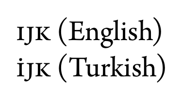
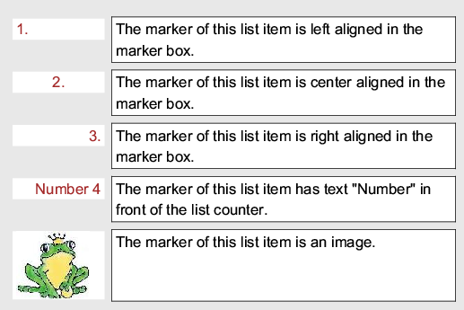
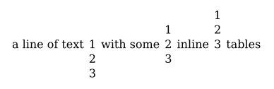
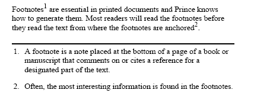

When preparing a document with HTML and CSS, you need to first create the content - but then you need to style it to make it visually appealing. You can choose which fonts to use, how to format your text and your paragraphs, choose the layout for your page, give your text, background and style some color, insert images - and much more!

In the following sections you can find detailed information on how to achieve this with Prince.

The major difference between formatting for the web and PDF/Print is that PDF is [paginated](paged.md), which means that content is placed on discrete pages, as opposed to one continuous flow, typical for web pages.

Prince allows you to control a number of options that affect how PDF formats pages, from straight-forward options such as page size, to decorations, headers and footers, numbering and page breaking options. See detailed information in the [Paged Media](paged.md) section.

Prince applies default styles to all (X)HTML documents - these style rules can be found in the `html.css` style sheet, located in the `style` folder inside the installation directory (see [Installation Layout](installing.md#installation-layout)). The initial values for CSS properties are defined internally - the initial `@page` styles are documented in the [Paged Media](paged.md) chapter.


Fonts
-----

Prince supports the Web Open Font (WOFF/WOFF2), TrueType and OpenType (with TTF or CFF outlines, SVG, and CBLC/CBDT or sbix colour bitmaps) font formats, as well as the TTC and WOFF2 font collections.

### Defining a font family

To define the font, or the fonts to be used in a document, the [`font-family`](css-props.md#prop-font-family) property is used. Prince will try to use the specified font, and should glyphs be missing, it will silently fall back to the next font in the cascade - typically a [generic font family](#generic-font-families).

To prevent this font switching mechanism and force Prince to only use the defined font, the special keyword `prince-no-fallback` is available: it triggers a warning if any glyphs are not found in the specified font, instead of switching to another one.

```
    h1 { font-family: MyFont, prince-no-fallback; }
```

The [`@font-face`](css-at-rules.md#at-font-face) at-rule can be used to define custom font names. The `font-family` descriptor defines the font family name that will be used in all CSS font family name matching, and the `src` descriptor specifies the resource containing font data. They both are required for the [`@font-face`](css-at-rules.md#at-font-face) rule to be valid.

The `src` descriptor can define the resource with a `url()` function - an optional `format()` function defines the format of the remotely fetched font. Alternatively, the `local()` and `prince-lookup()` functions can be used - the former searches for locally installed system fonts, while the latter will also find fonts defined by other [`@font-face`](css-at-rules.md#at-font-face) rules. See [CSS Functional Expressions](css-functions.md).

```
    @font-face {
      font-family: MyFont;
      src: prince-lookup("MyFont"),
           url("http://example.com/MyFont.ttf") format("truetype");
    }
```
In this example we are defining a new font face, called `MyFont`. We instruct Prince to check if the MyFont truetype font is installed locally or already defined by another @font-face rule, and, all failing, to download it from a remote location.

When a chosen bold and/or italic font is missing, Prince tries to artificially synthesize the missing font - i.e. to embolden or italicize the original font. However, it might lead to undesired results. This feature can be disabled with the [`--no-artificial-fonts`](command-line.md#cl-no-artificial-fonts) command-line option.

### OpenType Features in Prince

Prince supports OpenType features, and enables certain ones by default in specific scripts. The following ones are enabled by default in Prince:

<table class="grid">
<thead>
<tr>
<th>Script</th>
<th>Enabled features</th>
</tr>
</thead>
<tbody>
<tr>
<td>Latin, Greek, Cyrillic</td>
<td>ccmp, rlig, clig, liga, calt, dist, kern*, mark, mkmk, vrt2</td>
</tr>
<tr>
<td>Arabic/Syriac</td>
<td>ccmp, rlig, calt, liga, mset, isol, medi, init, fina, kern, curs, mark, mkmk</td>
</tr>
<tr>
<td>Indic</td>
<td>ccmp, and many other Indic-specific substitutions</td>
</tr>
<tr>
<td>Other scripts</td>
<td>kern*, mark, mkmk</td>
</tr>
</tbody>
<tfoot>
<tr>
<td colspan="2">
<p class="note">
* Kerning can be disabled with the <code><a href="/doc/css-props#prop-font-kerning">font-kerning</a></code> property.
</p>
</td>
</tr>
</tfoot>
</table>

Microsoft has a list of the OpenType feature names [here](https://www.microsoft.com/typography/otspec/featurelist.htm).

In order to enable specific OpenType features, or specific font variants, the following properties can be used:

* The property [`font-variant-caps`](css-props.md#prop-font-variant-caps) enables the display of small capitals (the OpenType features `smcp` and `c2pc`).
* The property [`font-variant-ligatures`](css-props.md#prop-font-variant-ligatures) allows for fine-tuning of various ligature types.  (See also [Typographic Ligatures](cookbook.md#typographic-ligatures)).
* The property [`font-variant-numeric`](css-props.md#prop-font-variant-numeric) specifies control over numeric forms.

Note that the [`font-variant`](css-props.md#prop-font-variant) CSS property can be used as a shorthand for these properties.

```
    font-variant: historical-ligatures all-small-caps oldstyle-nums;
```

Prince also supports language-specific OpenType shaping with the `locl` feature, which is automatically enabled with the use of the XML/HTML `lang` attribute.  As an example, the Arno Pro font has small-caps that are language sensitive, since Turkish has unique case rules for dotted and dotless letter "i".

```html
    <p><span xml:lang="en">IJK</span> (English)</p>
    <p><span xml:lang="tr">IJK</span> (Turkish)</p>
```

If this example is rendered with small-caps in the Arno Pro font, the two lines will look like this:



It is possible to also enable other OpenType features, not covered by the previous properties, by using the [`font-variant`](css-props.md#prop-font-variant) CSS property with the `prince-opentype()` function (see [CSS Functional Expressions](css-functions.md)).

It is a very powerful tool, but care must be taken in which order the features are enabled!  All required features need to be explicitly enabled: please note that enabling one feature will disable all the default features.


### Generic font families

Prince maps the CSS generic font families to the Microsoft Core Fonts. The Microsoft Core Fonts are pre-installed on Windows and MacOS X systems but not on Linux systems. To use them on Linux you must install the [msttcorefonts](http://corefonts.sourceforge.net) package, which is available for most Linux distributions.

The following table shows the default fonts for the main languages on Windows, MacOS X and Linux.

<table class="grid">
<thead>
<tr>
<th>Generic family</th>
<th>Operating system</th>
<th>Language</th>
<th>Actual font</th>
</tr>
</thead>
<tbody>
<tr>
<td rowspan="15"><code>serif</code></td>
<td rowspan="5">Windows</td>
<td>Latin</td>
<td>Times New Roman</td>
</tr>
<tr>
<td>Chinese</td>
<td>MingLiU, Microsoft YaHei, SimSun</td>
</tr>
<tr>
<td>Japanese</td>
<td>MS Mincho, Yu Gothic</td>
</tr>
<tr>
<td>Korean</td>
<td>Batang, Malgun Gothic</td>
</tr>
<tr>
<td>Devanagari / Hindi</td>
<td>Mangal</td>
</tr>
<tr>
<td rowspan="5">MacOS X</td>
<td>Latin</td>
<td>Times New Roman</td>
</tr>
<tr>
<td>Chinese</td>
<td>LiSong Pro</td>
</tr>
<tr>
<td>Japanese</td>
<td>Hiragino Mincho ProN</td>
</tr>
<tr>
<td>Korean</td>
<td>AppleMyungjo</td>
</tr>
<tr>
<td>Devanagari / Hindi</td>
<td>Devanagari MT</td>
</tr>
<tr>
<td rowspan="5">Linux</td>
<td>Latin</td>
<td>Times New Roman, DejaVu Serif, DejaVu LGC Serif, Liberation Serif</td>
</tr>
<tr>
<td>Chinese</td>
<td>AR PL UMing CN, AR PL SungtiL GB</td>
</tr>
<tr>
<td>Japanese</td>
<td>Kochi Mincho, IPAMincho</td>
</tr>
<tr>
<td>Korean</td>
<td>UnBatang, Baekmuk Batang</td>
</tr>
<tr>
<td>Devanagari / Hindi</td>
<td>Lohit Devanagari</td>
</tr>
<tr>
<td rowspan="12"><code>sans-serif</code></td>
<td rowspan="4">Windows</td>
<td>Latin</td>
<td rowspan="2">Arial</td>
</tr>
<tr>
<td>Chinese</td>
</tr>
<tr>
<td>Japanese</td>
<td>MS Gothic</td>
</tr>
<tr>
<td>Korean</td>
<td>Dotum</td>
</tr>
<tr>
<td rowspan="4">MacOS X</td>
<td>Latin</td>
<td>Arial</td>
</tr>
<tr>
<td>Chinese</td>
<td>LiHei Pro</td>
</tr>
<tr>
<td>Japanese</td>
<td>Hiragino Kaku Gothic ProN</td>
</tr>
<tr>
<td>Korean</td>
<td>Apple SD Gothic Neo, Apple Gothic</td>
</tr>
<tr>
<td rowspan="4">Linux</td>
<td>Latin</td>
<td>Arial, DejaVu Sans, DejaVu LGC Sans, Liberation Sans</td>
</tr>
<tr>
<td>Chinese</td>
<td>AR PL UKai CN, AR PL KaitiM GB</td>
</tr>
<tr>
<td>Japanese</td>
<td>Kochi Gothic, IPAGothic</td>
</tr>
<tr>
<td>Korean</td>
<td>UnDotum, Baekmuk Gulim</td>
</tr>
<tr>
<td rowspan="12"><code>monospace</code></td>
<td>Windows</td>
<td colspan="2" rowspan="2">Courier New</td>
</tr>
<tr>
<td>MacOS X</td>
</tr>
<tr>
<td>Linux</td>
<td colspan="2">Courier New, DejaVu Sans Mono, DejaVu LGC Sans Mono, Liberation Mono</td>
</tr>
</tbody>
</table>

The complete list of defaults, including details like e.g. the exact Unicode ranges Prince is using, can be found in the `fonts.css` file located in the installation directory of Prince resources. (See [Installation Layout](installing.md#installation-layout)).

In order to redefine these defaults, see [Redefining the generic font families](#redefining-the-generic-font-families).


### Redefining the generic font families

The CSS generic font families can be redefined to use different fonts by editing the `fonts.css` file in the Prince installation (see [Installation Layout](installing.md#installation-layout)). Each font family is defined using a [`@font-face`](css-at-rules.md#at-font-face) rule, which maps a font family to an actual font either by name or by filename. (See [Generic font families](#generic-font-families)).

Here is an example of mapping the generic "sans-serif" font family to the local system font called "Trebuchet MS".

fonts.css

```
    @font-face {
        font-family: sans-serif;
        src: local("Trebuchet MS")
    }
```
It is also possible to map the generic font families to local fonts specified by the filename of the TrueType font file. This will usually require using multiple [`@font-face`](css-at-rules.md#at-font-face) rules, one for each TrueType font file in the font family, which usually includes four files (normal, bold, italic and bold-italic). Here is an example of mapping the generic "sans-serif" font family to the "Trebuchet MS" font using filenames, assuming that the font is installed in the usual system directory on Linux.

fonts.css

```
    @font-face {
        font-family: sans-serif;
        font-style: normal;
        font-weight: normal;
        src: url("/usr/share/fonts/truetype/msttcorefonts/trebuc.ttf")
    }

    @font-face {
        font-family: sans-serif;
        font-style: normal;
        font-weight: bold;
        src: url("/usr/share/fonts/truetype/msttcorefonts/trebucbd.ttf")
    }

    @font-face {
        font-family: sans-serif;
        font-style: italic;
        font-weight: normal;
        src: url("/usr/share/fonts/truetype/msttcorefonts/trebucit.ttf")
    }

    @font-face {
        font-family: sans-serif;
        font-style: italic;
        font-weight: bold;
        src: url("/usr/share/fonts/truetype/msttcorefonts/trebucbi.ttf")
    }
```
Prince can be instructed not to use system fonts with the [`--no-system-fonts`](command-line.md#cl-no-system-fonts) command-line option. Only fonts defined with [`@font-face`](css-at-rules.md#at-font-face) rules in CSS will be available.


Layout
------

Layout is the way in which text and pictures are set out on a page. It defines the final look of a document. Prince understands layout by means of CSS, cascading style sheets.

In the following chapters we shall go through the main points when preparing the layout of a page. It mainly follows the general steps of layout for web pages: starting from [Text formatting](#text-formatting) and [Paragraph formatting](#paragraph-formatting), via the [Box Model](#box-model), until [Tables](#tables), [Lists](#lists), [Columns](#columns), [Floats](#floats), [Flex Layout](#flex-layout), and [Footnotes](#footnotes).

A separate chapter, [Paged Media](paged.md), will analyze in-depth the major difference between formatting for the web and PDF/Print, namely that PDF is paginated, content is placed on discrete pages.


### Text formatting

Text can be styled with CSS by defining font styles or text layout styles.

After choosing an appropriate typeface for your text with the [`font-family`](css-props.md#prop-font-family) property (see [Fonts](#fonts)), you can assign it different sizes with the [`font-size`](css-props.md#prop-font-size) property.

Next up you should decide whether to give it some `color`. The default text color for a page is defined in the `body` selector, but each selector can have its own color.

```
    body {
        font-family: Helvetica, Arial, sans-serif;
        color: blue;
    }
```
Special formatting can be achieved through the [`font-style`](css-props.md#prop-font-style), [`font-weight`](css-props.md#prop-font-weight) or [`font-variant`](css-props.md#prop-font-variant) properties - all of which can also be set with the shorthand property [`font`](css-props.md#prop-font). For special effects one can use the properties [`text-transform`](css-props.md#prop-text-transform), [`text-decoration`](css-props.md#prop-text-decoration) - or even [`text-shadow`](css-props.md#prop-text-shadow).

It is also possible to style the vertical alignment of text in an inline box with the [`vertical-align`](css-props.md#prop-vertical-align) property. The value `baseline` is the default, `sub` and `super` align the baseline of the element with the subscript-baseline or superscript-baseline of its parent respectively. The `text-top` and `text-bottom` values align the top of the element with the top or bottom of the parent's font, while `middle` aligns the middle of the element with the baseline plus half the x-height of the parent.

In order to determine how compact the text should be displayed, the `letter-spacing` can be used. Alternatively, the property [`font-stretch`](css-props.md#prop-font-stretch) might be used, but note that it does not change the geometry of any arbitrary font by stretching or shrinking it - instead, it merely instructs Prince to choose the most appropriate face of the font, if the selected font offers several ones. Also note that this property is not supported for system fonts on Windows.

In a similar fashion, the property [`word-spacing`](css-props.md#prop-word-spacing) can be used to determine the distance between words.

The directionality of the text is controlled through the [Writing Mode](#writing-mode).

### Paragraph formatting

Now that you have decided on the basic properties of the text, you can turn your attention to styling the paragraphs. The [`text-align`](css-props.md#prop-text-align) property is used to control how text is aligned within its containing box, while the [`text-indent`](css-props.md#prop-text-indent) property determines the indentation of the first line of text in the element.

If the [`text-align`](css-props.md#prop-text-align) property has a value of `left`, `right` or `center`, the text will be aligned to the left, right or center respectively. The `justify` value instructs Prince to justify text. It is not uncommon, in printed texts, to align text based on whether the text appears on a left or right page. To support this, two new keywords are added to the [`text-align`](css-props.md#prop-text-align) property: `inside` is the same as 'left' on right pages and 'right' on left pages, and `outside` is the same as 'right' on left pages and 'left' on right pages.

Prince adds the property [`-prince-text-justify`](css-props.md#prop-prince-text-justify) to define how to treat justified text for CJK languages. The value `prince-cjk` allows space to be inserted between CJK characters when justifying even if there aren't any space characters.

The last line of an element can receive its own alignment style with the [`text-align-last`](css-props.md#prop-text-align-last) property. It takes the same values as [`text-align`](css-props.md#prop-text-align).

```
    p {
        text-align: justify;
        text-indent: 5em;
    }
```
It is also possible to style the first line of a paragraph in a different way - to achieve this, the selector `::first-line` is used.

```
    p::first-line {
        text-indent: 8em;
    }
```
It is not unusual to give the first letter of a paragraph a bigger font size than the rest of the paragraph. The selector `::first-letter` is useful for this purpose.

```
    p::first-letter {
        font-size: 2em;
    }
```
One of the most common use cases is for so-called drop caps - large capital letters at the beginning of a chapter that have the depth of several lines of text.

In the following example we are selecting the first letter of the first paragraph, which gets styled much bigger than the normal text, and gets floated to the left. The normal text is wrapping around this first large letter.

```
    p:first-child::first-letter {
        font-size: 5em;
        line-height: 3rem;
        float: left;
    }
```
Another important aspect when formatting a paragraph is how compact the text lines should appear on the printed page. The property [`line-height`](css-props.md#prop-line-height) can be used to determine the height of text lines.

The property [`line-stacking-strategy`](css-props.md#prop-line-stacking-strategy) allows to choose whether individual lines should have their height determined based on their content, or whether all lines in a paragraph should have the same height, or a compromise where their heights are determined by their content and then rounded up to a multiple of the paragraph line height.

In order to lay out text in a well-balanced way, it might at times be necessary to hyphenate some words - to enable hyphenation, the [`hyphens`](css-props.md#prop-hyphens) property is used. For details please refer to the section on [Hyphenation](cookbook.md#hyphenation).

Prince also allows for line-breaking in certain situations even in the absence of whitespace - for example, after slashes in long URLs. This behavior can be disabled with the [`-prince-linebreak-magic`](css-props.md#prop-prince-linebreak-magic) property for situations in which more precise control over line-breaking is preferred.

The property [`overflow-wrap`](css-props.md#prop-overflow-wrap) controls wrapping behavior *of last resort*: whether it is better for a word to overflow its container, or to be broken at an arbitrary point (subject to [`white-space`](css-props.md#prop-white-space), and not splitting within a grapheme cluster), without adding a hyphen.

Prince does not support the value `break-word` of the property [`word-break`](css-props.md#prop-word-break) to achieve a similar effect. Use the value `break-all` of [`word-break`](css-props.md#prop-word-break), or the property [`overflow-wrap`](css-props.md#prop-overflow-wrap) with the value `break-word` instead.


### Writing Mode

A writing mode describes the directionality of a script, i.e. it describes the direction the script is to be read. In (X)HTML, the language of a document is defined by the `lang` or `xml:lang` attributes. To control the rendering of the text, a couple of CSS properties can be used: the [`direction`](css-props.md#prop-direction) property defines the inline direction of the script, that is left-to-right (like e.g. Latin or Indic scripts) or right-to-left (like e.g. Arabic and Hebrew scripts).

The [`writing-mode`](css-props.md#prop-writing-mode) property, on the other hand, describes the block direction of the script, namely whether the text should be laid out horizontally, top-to-bottom (like e.g. Latin or Arabic scripts), or vertically, right-to-left (like e.g. Chinese scripts). The default value is `horizontal-tb`, which means horizontal, top-to-bottom.

Prince sets the PDF direction based on the direction and writing mode of the document root element to support right-to-left books.

Changing the writing mode of a document, that is, the inline or block direction, not only changes the direction of the script, but also affects several other aspects of the printed document.

The page selector pseudo-classes `:recto` and `:verso` (see [Selecting pages](paged.md#selecting-pages)) are relative to the direction of the script. In a left-to-right script, `:recto` is the right-hand side of a spread, and `:verso` is the left-hand side, while in a right-to-left script these values are inverted: `:recto` defines the left-hand side of a spread, and `:verso` defines the right-hand side. See also [Selecting pages](paged.md#selecting-pages).

Columns (see the chapter on [Columns](#columns)) change their orientation when the writing mode is changed - the [`writing-mode`](css-props.md#prop-writing-mode) value `vertical-rl` arranges the columns horizontally, top-to-bottom.

This can be used to rotate content - see [Printing wide content sideways](cookbook.md#printing-wide-content-sideways) and [Rotating content in table cells](cookbook.md#rotating-content-in-table-cells).


### Box Model

All HTML elements follow the CSS box model. Their `margin`, `border`, `padding` and `background` can all be styled - and they can even cast a shadow with the property [`box-shadow`](css-props.md#prop-box-shadow).

#### Margin

At the very outside of the box are the margins. Each margin's size can be set individualy with the properties [margin-top](css-props.md#prop-margin-top), [margin-bottom](css-props.md#prop-margin-bottom), [margin-left](css-props.md#prop-margin-left) and [margin-right](css-props.md#prop-margin-right), or you can use the *shorthand property* [margin](css-props.md#prop-margin) to specify all four margins together. The syntax of the shorthand property is:

```
    margin: top right bottom left
```
If there are only:

-   three values: then the left margin is set equal to the right margin;
-   two values: then the left margin is set equal to the right margin, and the bottom margin is set equal to the top margin;
-   one value: then all margins are made equal.

Prince expands the margin properties with [`-prince-margin-inside`](css-props.md#prop-prince-margin-inside) and [`-prince-margin-outside`](css-props.md#prop-prince-margin-outside), defining the margin respectively on the inside or outside of a spread: inside is on the right when used on a left-facing page, and on left on a right-facing page; outside is on the left when used on a left-facing page, and on the right on a right-facing page.

Always keep in mind that `margin-top` and `margin-bottom` of blocks are combined (i.e. "collapsed") into a single margin according to a possibly rather complex behavior known as *margin collapsing*. The notable exception is the behavior of margins in [Flex Layout](#flex-layout).

Prince also supports [page and column floats](#page-and-column-floats) - in some cases, the `margin-top` and `margin-bottom` values of these floats are overwritten by alternative margin value specified with the [`-prince-margin-alt`](css-props.md#prop-prince-margin-alt) property.  For details, please see [Margins of Page and Column Floats](#margins-of-page-and-column-floats).

#### Border

The border of a box can be styled with several border properties. The borders can either be individually styled with [`border-top`](css-props.md#prop-border-top), [`border-right`](css-props.md#prop-border-right), [`border-bottom`](css-props.md#prop-border-bottom) and [`border-left`](css-props.md#prop-border-left), or the shorthand property [`border`](css-props.md#prop-border) can be used to style all four borders of the box in the same way.

To style the borders, the [`border-color`](css-props.md#prop-border-color), [`border-style`](css-props.md#prop-border-style) and [`border-width`](css-props.md#prop-border-width) properties can be used. For each of them, also `top`, `right`, `bottom` and `left` variants are available to style each border separately.

The [`border-radius`](css-props.md#prop-border-radius) property can be used for styling rounded corners.

The [`border-clip`](css-props.md#prop-border-clip) property splits the borders into parts along the border edge.  Please note that currently this property only applies to footnotes.

#### Padding

The property [`padding`](css-props.md#prop-padding) defines the padding inside the box model. Each padding's size can be set individually with the properties [padding-top](css-props.md#prop-padding-top), [padding-bottom](css-props.md#prop-padding-bottom), [padding-left](css-props.md#prop-padding-left) and [padding-right](css-props.md#prop-padding-right), or you can use the *shorthand property* [padding](css-props.md#prop-padding) to specify all four paddings together. The syntax of the shorthand property is:

```
    padding: top right bottom left
```
If there are only:

-   three values: then the left padding is set equal to the right padding;
-   two values: then the left padding is set equal to the right padding, and the bottom padding is set equal to the top padding;
-   one value: then all paddings are made equal.

#### Background

The background of an element can be styled with the [`background-color`](css-props.md#prop-background-color) and the [`background-image`](css-props.md#prop-background-image) properties, or with the shorthand property [`background`](css-props.md#prop-background). See also [Background Images](graphics.md#background-images).

Various standard properties are available to position the background, to clip it or to determine whether, and how it should be repeated. Prince extends control on the background with the [`-prince-background-image-resolution`](css-props.md#prop-prince-background-image-resolution) property, used to control image size in print (see [Image Size](graphics.md#image-size)), and with the `bleed` modifier of the [`background-attachment`](css-props.md#prop-background-attachment) property, which, when used together with `background-size: cover`, allows a background image to cover the entire page bleed area (see [Trimming marks](paged.md#trimming-marks)).


### Display

Every HTML element is displayed in a way depending on what type of element it is. Most elements are displayed as either `block` or `inline` elements. The default display value can be changed with the [`display`](css-props.md#prop-display) property.

A `block` element always starts on a new line and takes up all the available width.

An `inline` element, on the other hand, does not start on a new line, and only takes up as much space as necessary.

<p class="note">
<code>inline</code> elements are not allowed to have <code>block</code> elements inside it.
</p>

A hybrid type, namely the `inline-block` element, is like `inline` elements, but it can have a width and a height - which can be very useful when you want to create a grid of CSS boxes that fills all the width and wraps nicely. The inside of an `inline-block` element is formatted like a block box.

Care needs to be taken with `inline-block` elements, because Prince [cannot split them over several pages](help.md#faq-one-page).

The value `run-in` displays a block element as if it were an inline element at the beginning of the following block element.

With the value `list-item`, the element is effectively transformed into a list item - for more on lists, please see the chapter [Lists](#lists).

The value `flex` enables [Flex Layout](#flex-layout), while `inline-flex` makes an element behave like an inline element and lays out its content according to the flex layout model.

Several values refer to [Tables](#tables), making elements behave as if they were table elements. However, the value `inline-table` has no direct equivalent in HTML - it behaves like a `table` HTML element, but as an inline element, rather than a block element. Inside the table box is a block context.

The special value `none`, which removes the content from the document, is very useful when hiding certain elements in the printed layout.


### Transformations

Prince supports CSS transformations of Level 1, with some limitations: it recognizes [`transform`](css-props.md#prop-transform) and [`transform-origin`](css-props.md#prop-transform-origin), but does not recognize `transform-box`. Furthermore, Prince does not allow perspective transforms.

The [`transform`](css-props.md#prop-transform) property can be used to rotate, translate, scale or skew an element.

The [`transform`](css-props.md#prop-transform) property currently does not affect SVG elements - they need to use their own `transform` attribute instead.

The [`transform`](css-props.md#prop-transform) property function `rotate()` rotates the element clockwise from its current position. Negative values rotate conter-clockwise.

The function `translate()` moves an element along a vertical and/or horizontal axis. The functions `translatex()` and `translatey()` move the element along one of those axis only. The function `translate3d()` is supported if the Z (third) coordinate is zero, thus making it equivalent to the 2D `translate()`.

The function `scale()` affects the size of the element - note that this also alters other properties of an element, such as its [`font-size`](css-props.md#prop-font-size), [`padding`](css-props.md#prop-padding), [`height`](css-props.md#prop-height) and [`width`](css-props.md#prop-width). The functions `scalex()` and `scaley()` transform the element in one dimension only.

The functions `skewx()` and `skewy()` tilt an element to the left or right. There is no shorthand form.

The origin for the transformations, i.e. the point around which a transformation is applied, can be set with the [`transform-origin`](css-props.md#prop-transform-origin) property.

If only one term is given, then the second component is assumed to be `center`. In particular, if only a percentage or length is given, then it is assumed to be the horizontal coordinate.

If both values are given as keywords, order doesn't matter; but if two coordinates are given and either coordinate is a length or percentage, then the horizontal component must come first: so `top 50%` is not valid, but `top` and `top center` and `50% top` are all valid and equivalent.


### Lists

A list item has two parts: `marker` and `content`.

The `content` part is rendered inside the list item's border box, and is styled the same way as a normal block, such as `div` or `p` element.

The `marker` positioning is determined by the [`list-style-position`](css-props.md#prop-list-style-position) property and is styled using the `::marker` pseudo-element.

#### List markers

The [`content`](css-props.md#prop-content) property can be applied to the `::marker` pseudo-element to specify a custom marker for list items.

CSS

```
    li::marker { content: "No. " counter(list-item) }
```
#### List marker position

List markers are rendered outside the list item in the left margin area by default. If the CSS property [`list-style-position`](css-props.md#prop-list-style-position) has value `inside`, the marker is rendered as the first inline box inside the list item.

CSS
```
    ol {
        padding-left: 1cm;
        border: solid 2px darkgreen
    }
    li { border: solid 1px black }
    li.inside { list-style-position: inside }
    li.outside { list-style-position: outside }
```
Output

<ol style="border: solid 2px darkgreen">
<li style="border: solid 1px black; list-style-position: inside">
    This list item sets the <code><a href="/doc/css-props#prop-list-style-position">list-style-position</a></code> to <code>inside</code>,
    so the list marker is rendered inside the principal box of <code>li</code>.
</li>
<li style="border: solid 1px black; list-style-position: outside">
    This list item sets the <code><a href="/doc/css-props#prop-list-style-position">list-style-position</a></code> to <code>outside</code>,
    so the list marker is rendered outside the principal box of <code>li</code>.
</li>
</ol>

When the marker position is <code>outside</code>,
it is rendered outside the <code>li</code> principal box.
If you want the marker to appear inside the principal box of
<code>ol</code>,
make sure to give <code>ol</code> enough left padding
or <code>li</code> enough left margin.


#### List marker type

Different list marker types can be chosen by setting the CSS property [`list-style-type`](css-props.md#prop-list-style-type) to different values. This property applies to list items and determines the type of marker that they receive. The following table shows examples of some list style types (for a table with examples of supported options for ordered lists, see [Counter styles](gen-content.md#counter-styles)).

|                              |                                 |
|------------------------------|---------------------------------|
| `box`                        | ▫, ▫, ▫, ...                    |
| `check`                      | ✓, ✓, ✓, ...                    |
| `circle`                     | ◦, ◦, ◦, ...                    |
| `diamond`                    | ♦, ♦, ♦, ...                    |
| `disc`                       | •, •, •, ...                    |
| `hyphen`                     | -, -, -, ...                    |
| `square`                     | ▪, ▪, ▪, ...                    |
| `decimal`                    | 1, 2, 3, ...                    |
| `decimal-leading-zero`       | 01, 02, 03, ... 09, 10, 11, ... |
| `lower-alpha`, `lower-latin` | a, b, c, ... z, aa, ab, ...     |
| `upper-alpha`, `upper-latin` | A, B, C, ... Z, AA, AB, ...     |
| `lower-roman`                | i, ii, iii, iv, v, vi, ...      |
| `upper-roman`                | I, II, III, IV, V, VI, ...      |
| `asterisks`                  | \*, \*\*, \*\*\*, ...           |

CSS
```
    li.upper-alpha { list-style-type: upper-alpha }
    li.lower-roman { list-style-type: lower-roman }
```
Output

<ol>
<li style="list-style-type: upper-alpha">
    The marker type of this list item is upper-alpha.
</li>
<li style="list-style-type: lower-roman">
    The marker type of this list item is lower-roman.
</li>
</ol>


#### List marker style

The list marker can also be replaced by an image by using the [`list-style-image`](css-props.md#prop-list-style-image) property.

The shorthand property [`list-style`](css-props.md#prop-list-style) can be used to set the three properties [`list-style-image`](css-props.md#prop-list-style-image), [`list-style-position`](css-props.md#prop-list-style-position) and [`list-style-type`](css-props.md#prop-list-style-type) together.

Alternatively, the `::marker` pseudo-element can be used to style the list item marker, giving full control over its content, width, alignment and so on.

CSS
```
    li::marker { width: 2.4cm }
    li.left::marker { text-align: left }
    li.center::marker { text-align: center }
    li.right::marker { text-align: right }
    li.text_marker::marker {
        content: "Number " counter(list-item)
    }
    li.image_marker::marker {
        content: url("../../image/prince.jpg")
    }
```
Output



### Tables

#### Automatic table layout

When the *automatic table layout* algorithm is used, all contents of the table will be processed to determine the table width and its column width.

The *automatic table layout* algorithm is used in the following situations:

-   by default; or
-   when table [`table-layout`](css-props.md#prop-table-layout) property is `auto`; or
-   when table [`width`](css-props.md#prop-width) property is `auto`, regardless of the value of the [`table-layout`](css-props.md#prop-table-layout) property.

The basic rules used by Prince can be summarized as follows:

-   Uses all contents of a column to calculate its maximum and minimum width. The minimum width typically ensures that the column should be big enough to hold the widest non-breakable unit (for example, a word or an image). The maximum width typically ensures that the column should hold all cell contents without breaking line (unless an explicit line break occurs).
-   If a calculated minimum or maximum column width is smaller than the corresponding specified column width, it will be replaced with the specified column width.
-   If table `width` has value `auto`, and if the table fits in the container when using maximum column widths, then maximum column widths will be used. Otherwise, minimum column widths will be used, but they will be adjusted, if the sum of them is smaller than the specified the table width or the container width, so that the table can take up as much space as possible.

#### Fixed table layout

When the *fixed table layout* algorithm is used, the table column widths are determined by their specified widths or by the remaining space available, regardless of their contents.

The *fixed table layout* algorithm is used in the following situations:

-   when the table [`table-layout`](css-props.md#prop-table-layout) property has a value `fixed`, and
-   the value of [`width`](css-props.md#prop-width) property is not `auto`

```
    table {
        table-layout: fixed;
        width: 90%
    }
```
Note that if the [`width`](css-props.md#prop-width) property has value `auto` (which is the default value), the [`table-layout`](css-props.md#prop-table-layout) property will be ignored and automatic table layout will be used instead.

The basic rules used by Prince are as follows:

-   If a column has a specified width, then the specified width is used as its minimum width.
-   For columns that do not have specified widths, the remaining space (specified table width - sum of all the specified column widths) is evenly divided among them as their minimum widths.
-   If the sum of all the minimum column widths is smaller than the specified table width, they will be adjusted to eat up the remaining space.

#### Separated table borders

When the [`border-collapse`](css-props.md#prop-border-collapse) property is set to `separate`, a table can have separate borders around individual cells. The space between table cell borders is determined by the value of its [`border-spacing`](css-props.md#prop-border-spacing) property.

CSS
```
    table {
        border-collapse: separate;
        border-spacing: 5px;
        border: solid 3px black
    }
    td { border: solid 1px red }
    td.dash-blue  { border: 2px dashed blue }
    td.solid-green { border: 2px solid green }
```
Output

<table style="border-collapse: separate; border-spacing: 5px; border: solid 3px black;">
<tr>
    <td style="border: solid 1px red"> A </td>
    <td style="border: solid 1px red"> B </td>
    <td style="border: solid 1px red"> C </td>
</tr>
<tr>
    <td style="border: solid 1px red"> D </td>
    <td style="border: 2px dashed blue"> E </td>
    <td style="border: 2px solid green"> F </td>
</tr>
<tr>
    <td style="border: solid 1px red"> G </td>
    <td style="border: solid 1px red"> H </td>
    <td style="border: solid 1px red"> I </td>
</tr>
</table>

Note that by default,
the value of <code><a href="/doc/css-props#prop-border-collapse">border-collapse</a></code> is
<code>separate</code>.


#### Collapsing table borders

When the CSS property [`border-collapse`](css-props.md#prop-border-collapse) is set to `collapse`, each edge of each cell resolves its final border style and border width based on certain rules.

CSS
```
    table {
        border-collapse: collapse;
        border: solid 3px black
    }
    table td { border: solid 1px red }
    td.dash-blue  { border: 2px dashed blue }
    td.solid-green { border: 2px solid green }
```
Output

<table style="border-collapse: collapse; border-spacing: 5px; border: solid 3px black;">
<tr>
    <td style="border: solid 1px red"> A </td>
    <td style="border: solid 1px red"> B </td>
    <td style="border: solid 1px red"> C </td>
</tr>
<tr>
    <td style="border: solid 1px red"> D </td>
    <td style="border: 2px dashed blue"> E </td>
    <td style="border: 2px solid green"> F </td>
</tr>
<tr>
    <td style="border: solid 1px red"> G </td>
    <td style="border: solid 1px red"> H </td>
    <td style="border: solid 1px red"> I </td>
</tr>
</table>

Note that the [`border-spacing`](css-props.md#prop-border-spacing) property is not used
in the collapsing table border model.


The rules used by Prince for choosing the "winner" border are as follows:

-   If a border has a border style of `hidden`, it beats those with other border styles;
-   Otherwise, if a border has a border style of `none`, it loses to those with other border styles;
-   Otherwise, if a border has thicker border width, it beats those with thinner ones;
-   Otherwise, a border wins if its border style has higher precedence. The precedence order is: `solid`, `dashed` then `dotted`;
-   Otherwise, a border wins if it is set in a part that has higher precedence. The precedence order is: cell, row, row-group then table.

#### Cells that span columns

Prince table cells that span multiple columns using the [`table-column-span`](css-props.md#prop-table-column-span) CSS property, which takes an integer value and is set to 1 by default.

CSS
```
    td.colspan2 { table-column-span: 2 }
```
XML
```xml
    <td class="colspan2"> B </td>
```
Output

<table class="colspan">
<tr>
<td>A</td> <td class="colspan2" colspan="2">B</td>
</tr>
<tr>
<td>C</td> <td>D</td> <td>E</td>
</tr>
</table>


#### Cells that span rows

Prince supports table cells that span multiple rows using the [`table-row-span`](css-props.md#prop-table-row-span) CSS property, which takes an integer value and is set to 1 by default.

CSS
```
    td.rowspan2 { table-row-span: 2 }
```
XML
```xml
    <td class="rowspan2"> A </td>
```
Output

<table class="rowspan">
<tr>
<td class="rowspan2" rowspan="2" style="vertical-align: middle">A</td> <td>B</td> <td>C</td>
</tr>
<tr>
<td>D</td> <td>E</td>
</tr>
</table>


#### Numbering table rows

If you want to number table rows in a table, but there are just too many rows to number by hand, or if the document is dynamically generated and hand numbering is impossible, CSS counters and generated content can help you out:

CSS
```
    table { counter-reset: row }
    tr { counter-increment: row }
    tr::before {
        content: counter(row);
        display: table-cell
    }
```
HTML
```html
    <table>
    <tr><td>The First Table Row</td></tr>
    <tr><td>The Second Table Row</td></tr>
    <tr><td>The Third Table Row</td></tr>
    </table>
```
Output

<table>
<tr><td class="counter">1</td><td>The First Table Row</td></tr>
<tr><td class="counter">2</td><td>The Second Table Row</td></tr>
<tr><td class="counter">3</td><td>The Third Table Row</td></tr>
</table>


As pseudo-elements only inherit inheritable properties
from the element they are attached, non-inheritable properties, such as
display and border properties, need to be explicitly set in the pseudo-elements.


#### Running table headers and footers

When a table spans across more than one page, it might be desirable to have a "running" table header and footer so that they can be carried on to all the subsequent pages on which the table appears.

HTML
```html
    <table>
      <thead>
        <tr> <td>Name</td> <td>Mark</td> <td>Grade</td> </tr>
      </thead>
      <tr> <td>Xuehong</td> <td>95</td> <td>H1</td> </tr>
      <!-- other rows for other students -->
      <tfoot>
        <tr> <td>Name</td> <td>Mark</td> <td>Grade</td> </tr>
      </tfoot>
    </table>
```
Rows inside the <code>thead</code> element are used as a running table header.
Rows inside the <code>tfoot</code> element are used as a running table footer.


See also [Long Tables](cookbook.md#long-tables).

#### Table captions

Tables can also be provided with a table caption by using the `caption` HTML element, or by styling an arbitrary element with `display: table-caption` to be made to behave like `caption` elements. The caption is positioned above the table by default, but it can be moved to the bottom with the [`caption-side`](css-props.md#prop-caption-side) property.

When a table spans across more than one page, the [`-prince-caption-page`](css-props.md#prop-prince-caption-page) property determines whether table captions will be displayed on the first page of a table, or only on the following pages, or repeated on every page that a table appears on. See also [Fancy Table Captions](cookbook.md#fancy-table-captions).


#### Inline tables

Tables can also appear as inline elements in running text - to do so, use `display: inline-table`.

Vertical alignment of these inline tables can be defined with the property [`table-baseline`](css-props.md#prop-table-baseline), which is used to define which table row is treated as the baseline for the vertical alignment.

CSS
```css
    .inline { display: inline-table; }
    td { vertical-align: baseline; }
```
HTML
```html
    <div>
      a line of text
      <table class="inline" style="table-baseline: 1">
        <tr><td>1</td></tr>
        <tr><td>2</td></tr>
        <tr><td>3</td></tr>
      </table>
      with some
      <table class="inline" style="table-baseline: 2">
        <tr><td>1</td></tr>
        <tr><td>2</td></tr>
        <tr><td>3</td></tr>
      </table>
      inline
      <table class="inline" style="table-baseline: 3">
        <tr><td>1</td></tr>
        <tr><td>2</td></tr>
        <tr><td>3</td></tr>
      </table>
      tables.
    </div>
```
Output



### Columns

Reading long lines of text can be difficult - multiple columns have been used in print for a very long time. CSS allows for clean styling in multiple columns with the help of several properties.

The [`column-count`](css-props.md#prop-column-count) property specifies the number of columns for the selected element - the column width will be calculated automatically. Alternatively, you can define the (optimal) width of a column with the [`column-width`](css-props.md#prop-column-width) property, and the number of columns will be defined automatically. Note that Prince might make small adjustments to the actual width in order to use the available space at its best. Both values can also be set simultaneously with the shorthand [`columns`](css-props.md#prop-columns) property.

```
    p {
        column-count: 3;
    }
```
The height of the columns is balanced by default, and the text is distributed to the available columns so that the height of the content in each column is approximately equal. In some situations it might be desirable to explicitly determine the height of the columns, creating as many columns as necessary. This is achieved by setting the [`height`](css-props.md#prop-height) or [`max-height`](css-props.md#prop-max-height) properties on a multi-column block.

With the [`column-gap`](css-props.md#prop-column-gap) property the distance between columns can be styled and the [`column-rule`](css-props.md#prop-column-rule) property allows the addition of a line between columns - this is similar to using [`border-left`](css-props.md#prop-border-left) or [`border-right`](css-props.md#prop-border-right) properties.

```
    p {
        column-gap: 2em;
        column-rule: red dotted thin;
    }
```
The [`column-fill`](css-props.md#prop-column-fill) property determines how the content is distributed to fill various columns: the property can be set to `auto`, filling the columns sequentially, or `balance`, dividing the content in equal ways between the columns.

When content is laid out in multiple columns, Prince can determine where column breaks are placed in a similar way to breaking content into pages. Use the properties [`break-before`](css-props.md#prop-break-before) and [`break-after`](css-props.md#prop-break-after) with the value `column` to fine tune this behavior.

<p class="note">
Prince also supports the properties <a href="/doc/css-props/#prop-column-break-before"><code>column-break-before</code></a> and <a href="/doc/css-props/#prop-column-break-after"><code>column-break-after</code></a>. However, you are encouraged to use the newer properties <a href="/doc/css-props/#prop-break-before"><code>break-before</code></a> and <a href="/doc/css-props/#prop-break-after"><code>break-after</code></a> with the keyword <code>column</code> from the CSS Fragmentation Module Level 3.
</p>

If an element is to break the flow and span several columns, the property [`column-span`](css-props.md#prop-column-span) helps to achieve this. For floated elements (see [Floats](#floats)) a numeric value tells Prince how many columns the element should span. A numeric value other than `1` will only affect floated elements.

The following example instructs Prince to make the `h1` heading element span all the columns:

```
    body {
        column-count: 3;
    }
    h1 {
        column-span: all;
    }
```

Please note that starting with Prince 14, Prince treats a non-multi-column layout as a *single column layout*.


### Floats

When printed texts contain images, the text is usually laid out to wrap around those images. To accomplish the same with CSS, the images are floated - either to the left or right of text, or at times even to the top or to the bottom of a column. The [`float`](css-props.md#prop-float) property does just this - it floats an element, allowing the content of other elements to flow around it.

```
    img {
        float: right;
    }
```
The property [`clear`](css-props.md#prop-clear) can be considered the float's sister property: an element that has the [`clear`](css-props.md#prop-clear) property set on it will not move up, next to the floated element, like the float is asking for. Instead, it will move down after the float.

Prince extends the traditional behavior of floats with a few features that have been ubiquitous in printing for a long time.  In addition to the following documentation, the [quick guide to page and column floats in Prince 14](https://www.princexml.com/howcome/2021/guides/float/) provides many more examples for float, clear and defer properties.

#### Prince Extensions to Floats

Traditionally, floats move in the inline direction, left or right. Prince extends this behavior with page and column floats that move in the block direction, specifying that an element should be floated to the top, to the bottom, or to the nearest edge of a page or of a column.

This allows for more flexible layout options that meet the needs of formatting documents for print.

Prince's implementation of `float` differs from the standard implementation under the hood: it really is a shorthand for the following properties:

* [`-prince-float-reference`](css-props.md#prop-prince-float-reference)
* [`-prince-float-placement`](css-props.md#prop-prince-float-placement)
* [`-prince-float-modifier`](css-props.md#prop-prince-float-modifier)

The values for *where* to float an element to, which traditionally are assigned with the property `float`, are now defined by the property `-prince-float-placement`.  However, when using the shorthand `float`, no difference to the standard implementation can be noticed.

Thus, the following two examples achieve exactly the same when used in a multi-column page:

```
    img {
        float: right;
    }
```

```
    img {
        -prince-float-reference: column;
        -prince-float-placement: right;
    }
```

Please keep in mind that starting with Prince 14, Prince treats a non-multi-column layout as a *single column layout*.  The default reference context for a float is `column`.  In most cases this should be of no concern for users.  However, in some corner cases this might lead to unexpected consequences.

All float-related properties have our vendor prefix `-prince-`, since they differ from the standard.  When using standard values in our documentation, we use the form without prefix:

```
    img {
        float: right;
    }
```

However, when using a non-standard value, we use the form with prefix:

```
    img {
        -prince-float: top;
    }
```

##### Page and Column Floats

When giving the [`-prince-float`](css-props.md#prop-prince-float) property the value `top` or `bottom`, the element will be floated to, respectively, the top or the bottom of the column or page - the correct reference context for the float is defined through the [`-prince-float-reference`](css-props.md#prop-prince-float-reference) property.

```
    img {
        -prince-float: top;
        -prince-float-reference: page;
    }
```

Note that from Prince 14 onwards, the element will by default be floated to the top or bottom of the *column* it appears in.  This should mostly work as intended, since a normal page can be considered simply as a layout with one column!  However, earlier implementations of page floats with the [`float`](css-props.md#prop-float) property would float to the top of a *page* also in a multi-column layout.  If the previous behaviour is the desired one, the following style rule needs to be added to your stylesheet:

```
    * { -prince-float-reference: page; }
```

The value `top-bottom` tries to float the element to the top of the reference context (i.e. a column or a page), and if that should not be possible, it is floated to the bottom.

Note that when setting only the value for `-prince-float-reference` in the shorthand property `-prince-float`, i.e. `column` or `page`, the default value for `-prince-float-placement` is `top-bottom` and differs from its initial value!  This means that Prince will try to float the element to the top of the indicated float reference, and if that should not be possible, it would be floated to the bottom.

```
    img {
        -prince-float: page;
    }
```

The value `snap` instructs Prince to float the image to the *nearest* end, which could be either the top or bottom of the page or column.

```
    img {
        -prince-float: snap;
    }
```

A floated element in a multi-column context can span several columns with the help of the [`column-span`](css-props.md#prop-column-span) property (see [Columns](#columns)). The following example, when used in a multi-column layout with two columns, instructs Prince to make the image span all columns:

```
    img {
        -prince-float: top;
        column-span: 2;
    }
```

A similar result can be achieved by specifying the page as a float reference:

```
    img {
        -prince-float: page top;
    }
```

However, there is an important difference: an image with `column-span: all` will stay *within* its parent element, but an image with the page defined as a float reference will *escape* its parent and align itself with the page area, as can easily be seen in [this example](https://www.princexml.com/howcome/2021/guides/float/#escaping-columns).

##### Page and Column Float Order

Floating elements can sometimes appear in a different order than the source order - to exactly control the order, Prince provides the property [`-prince-float-policy`](css-props.md#prop-prince-float-policy).  The value `in-order` tells Prince to always show the floated elements in the order in which they were defined in the source, while the value `normal` makes them appear in the processing order.

The following example will float both figures to the bottom, and the figure with class `one` will float *above* the one with class `two`:

HTML
```html
    <figure class="one"></figure>
    <figure class="two"></figure>
```
CSS
```css
    figure { 
        -prince-float: bottom;
        -prince-float-policy: in-order;
    }
```

Would the `in-order` directive have been omitted, the figure with class `two` would have been floated above the one with class `one`.

##### Dropping Excess Floats

The property [`-prince-float-tail`](css-props.md#prop-prince-float-tail) instructs Prince how to deal with page floats that end up past the end of normal content: with the value `fill-page`, Prince will try to fill the last page, but discard any page floats that would create more pages.  The value `keep` will keep all images and create enough new pages to accomodate them all.

##### Margins of Page and Column Floats

Margins in vertical flows are a powerful styling tool.  Setting a vertical margin to the value `auto` will expand, and thereby repel other content - setting both top and bottom margins to `auto` will vertically center the element!

```
    img {
        -prince-float: top;
        margin: auto 0;
    }
```

See also [this example](https://www.princexml.com/howcome/2021/guides/float/#repelling-other-content) for repelling other content from column floats.

When elements snap to the nearest edge, it is impossible to predict whether they end up at the top or at the bottom.  Therefore Prince offers a way to specify an alternative margin value for the vertical margins with the property [`-prince-margin-alt`](css-props.md#prop-prince-margin-alt).

```
    img { 
        -prince-float: snap;
        margin: 1em 0;
        -prince-margin-alt: 0; 
    }
```

##### Spread Floats

In print one typically has to deal with left facing and right facing pages, together forming a spread. To take this into account when placing an element, Prince extends the [`float`](css-props.md#prop-float) property with the values `inside` and `outside`, moving the element respectively to the inside or outside of a spread.

If the `inside` and `outside` values are used in a multi-column layout, by default the element is floated to the inside or outside of the column it appears in its natural flow.  To change this behaviour, the page float reference needs to be specified:

```
    img {
        -prince-float: page inside;
    }
```

##### Deferring Floats

Floats can be deferred, to be laid out at a later position.  The properties [`-prince-float-defer-column`](css-props.md#prop-prince-float-defer-column) and [`-prince-float-defer-page`](css-props.md#prop-prince-float-defer-page) are used to defer the float to, respectively, some other column or page.

##### Page and Column Footnotes

The value `footnote` transforms the element into a footnote: it creates a footnote call in the place where it appears in its natural flow, and moves the element to the bottom of the column - please note that a normal page is considered to be a single column layout. The footnote marker is placed outside of the block of the footnote. With the value `inline-footnote`, the footnote marker is placed inside of the block of the footnote. To move the footnote to the bottom of a page in a multi-column layout, instead of to the bottom of its column, the correct float reference needs to be defined with the [`-prince-float-reference`](css-props.md#prop-prince-float-reference) property.  See also [Footnotes](#footnotes).

##### Sidenote floats

Prince allows elements to be floated to a predefined sidenote area, left or right of the main page area.  Within that region, they can be placed at the top or the bottom, or be aligned in different ways with their natural anchoring points. For more details see [Sidenotes](#sidenotes).

##### Conditional Modifiers

The property [`-prince-float-modifier`](css-props.md#prop-prince-float-modifier) is to be used in combination with other float instructions.  When used with the value `unless-fit` it expresses a conditional: the element is only floated if it would otherwise cause a page or column break. For example, If you have a large image that happens to occur at the end of the page, it could force a page break and leave a gap at the end of the previous page. So you could float the image with the modifier value `unless-fit`, which would move it to the top of the next page *unless it fits on the current page without causing a break and leaving a gap*:

```
    img {
        -prince-float-placement: top;
        -prince-float-modifier: unless-fit;
    }
```

Or, in shorthand notation:

```
    img {
        -prince-float: top unless-fit;
    }
```


##### Clearing Floats

Prince also extends the [`clear`](css-props.md#prop-clear) property with new keywords.

The values `inside` and `outside` clear inside and outside spread floats, while the keyword `both` clears&hellip; both.

The clear values for page and column floats are very powerful in multi-column layout.  Imagine that you have a two-column layout with a first float at the top of the first column.  If you create a second column float whose natural position would be just below the first one, then:

* `-prince-clear: end` clears the float and forces the second float to the next available placement, i.e. to the bottom of the first column;
* `-prince-clear: column` clears the column and forces the second float to the second column;
* `-prince-clear: page` clears the page and forces the second float to the next page.

For page floats, the clear values `column` and `page` behave the same way, since Prince treats the page as a single column.

Please also see the examples for [clearing page floats](https://www.princexml.com/howcome/2021/guides/float/#clearing-page-floats) and [clearing column floats](https://www.princexml.com/howcome/2021/guides/float/#clearing-column-floats).

### Footnotes

Prince supports footnotes using the [`float`](css-props.md#prop-float) property. If an element has the property `float: footnote` then it will be floated into the footnote area of the page and a reference will be placed in the text.

This example shows some simple footnotes, the `.fn` class is used to create footnotes:

Footnotes example




CSS

```
    .fn {
        float: footnote
    }
```
HTML

```html
    <p>
    Footnotes<span class="fn">A footnote is a note placed at
    the bottom of a page of a book or manuscript that comments on or
    cites a reference for a designated part of the text.</span>
    are essential in printed documents and Prince knows how to generate
    them. Most readers will read the footnotes before they read the text
    from where the footnotes are anchored<span class="fn">Often,
    the most interesting information is found in the footnotes.</span>.
    </p>
```
Each footnote implicitly increments the *footnote* counter which is used to number the footnotes. The footnote counter can be reset at each new page, section or chapter as necessary. This example resets the counter on each new page.

```
    @page {
        counter-reset: footnote
    }
```
#### Footnote calls

Footnote calls are the numeric anchors in the text that refer to the footnotes. Prince will generate footnote calls using the `::footnote-call` pseudo-element. This is the default style for footnote calls:

```
    *::footnote-call {
        content: counter(footnote);
        font-size: 83%;
        vertical-align: super;
        line-height: none
    }
```
This will display the current value of the footnote counter in a superscript position in a slightly smaller font than the main text. The `line-height` declaration ensures that the superscript position of the footnote does not affect the line height of the main text.

The footnote call style can be customized to use different fonts or colors. It can even be customized to include different content, such as placing the footnote counter in brackets rather than making it superscript.

```
    *::footnote-call {
        content: "[" counter(footnote) "]";
        font-size: inherit;
        vertical-align: inherit;
    }
```
This rule will generate footnote calls with the number of the footnote in brackets, like this: \[1\], \[2\], \[3\].

#### Footnote markers

Prince automatically generates footnote markers, the numeric markers placed in front of the footnote text. Footnote markers are similar to the markers added to list items (see [Lists](#lists)) in most respects, and can be styled in a similar fashion using the `::footnote-marker` pseudo-element:

```
    *::footnote-marker {
        font-weight: bold
    }
```
This rule will generate footnote markers with a bold font.

Footnote markers are rendered outside the footnote in the left margin area by default. If the CSS property [`footnote-style-position`](css-props.md#prop-footnote-style-position) has value `inside`, the marker is rendered as the first inline box inside the footnote. This property is similar to the [`list-style-position`](css-props.md#prop-list-style-position) property that applies to list markers (see [Lists](#lists)).

#### Styling and behavior of footnotes

Footnotes are placed within the `@footnote` area of the page (see [Page regions](paged.md#page-regions)), which can be styled within [`@page`](css-at-rules.md#at-page) rules.

```
    @page {
        @footnote {
            border-top: solid black thin;
            padding-top: 8pt
        }
    }
```
This rule adds a border and some padding to the top of the footnotes area.

If there are no footnotes on a page, the footnotes area will not be displayed on that page at all.

By default, the `@footnote` area is at the bottom of the page. However, Prince allows to position the area in different places, effectively offering a mechanism to create simple sidenotes (see [Sidenotes](cookbook.md#sidenotes)).

```
    @page {
        @footnote {
            position: absolute;
            left: 10px;
        }
    }
```
This rule moves the footnotes area to the left side of a page.

Footnotes are created with the [`float`](css-props.md#prop-float) property (see also [Floats](#floats)): an element can be removed from the normal flow of the document by styling it with the `footnote` value. This creates a footnote call in the place where the element would be in its natural flow, and moves the element's content to the bottom of the page. The footnote marker is rendered outside the footnote in the left margin area, and the footnote is displayed as a block element.

The property [`footnote-display`](css-props.md#prop-footnote-display) can be used to change the default display of footnotes: besides the default `block` display, they can be also treated as `inline` elements. The value `compact` leaves it up to Prince to determine whether to display the footnote as a block or inline element: if two or more footnotes fit on one line, they will be treated as inline elements to take up less space.

Making a footnote into an inline element moves the footnote marker into the footnote box as the first inline box inside the footnote.

The [`-prince-float`](css-props.md#prop-prince-float) property offers also the value `inline-footnote`, which is another mechanism to transform the footnote into an inline element.

Please note that from Prince 14 onwards, the footnote will by default be floated to the top or bottom of the *column* it appears in!  In a multi-column layout, footnotes are thus rendered by default at the bottom of each column!  To float them to the bottom of the page, as was previous behaviour, the correct float context needs to be defined with the [`-prince-float-reference`](css-props.md#prop-prince-float-reference) property.  See also [Page and Column Floats](#page-and-column-floats).

In some situations it might happen that footnotes do not fit on the page on which the footnote call was placed. It might be desirable to tie the footnote to the same page as the call - the property [`-prince-footnote-policy`](css-props.md#prop-prince-footnote-policy) can be of help. The following example instructs Prince to move the line with the footnote call to the next page, in order to keep it on the same page as the footnote itself:

```
    p {
      -prince-footnote-policy: keep-with-line;
    }
```
Alternatively, the value `keep-with-block` moves the entire paragraph to the next page.

<p class="note">
This property must be applied to the paragraph in which the footnote occurs, not to the footnote element itself.
</p>


### Sidenotes

Prince supports sidenotes using extensions to the `float` property. If an element has the property `-prince-float: sidenote` then it will be floated into the sidenote area of the page - think of it like a float to the left or to the right, yet *into a predefined area*.  Sidenotes are thus not automatically numbered the way footnotes are.

A sidenote area needs to be first defined as an `@page` region.

```
    @page {
        @rightnote { width: 40vw; }
    }
```

To float the note to the sidenote area, the `float-reference` property is used with the value `sidenote`.

```
    note {
        -prince-float-reference: sidenote;
    }
```

If two sidenote areas are defined as `@leftnote` and `@rightnote`, you need to specify into which area to float your note.  For page spreads, the sidenote areas `@insidenote` and `@outsidenote` can be defined.

```
    note.left {
        -prince-float-reference: leftnote;
    }
    note.right {
        -prince-float-reference: rightnote;
    }
```

By default, sidenotes appear near their natural anchoring points - the top of the sidenote will be aligned with the top of the box where it naturally appears.  This is expressed by the value `align-top` of the `-prince-float-placement` property.  If more than one sidenote naturally appears on the same line, the sidenotes will be stacked in the content order.  The value `align-bottom` is used to align the *bottom* of the sidenote with the top of the box where it naturally appears.

```
    note {
        -prince-float-reference: rightnote;
        -prince-float-placement: align-bottom;
    }
```

Alternatively, sidenotes can also be floated to the top, or to the bottom within the sidenote area.

```
    note {
        -prince-float-reference: rightnote;
        -prince-float-placement: top;
    }
```

Please note that this affects also the stacking order: if sidenotes are floated to the top, subsequent notes will be naturally stacked below the first note.  If however they are floated to the bottom, subsequent notes will be stacked *above* the previous notes!

The property `-prince-float` can be used as a shorthand:

```
    note {
        -prince-float: rightnote top;
    }
```


### Flex Layout

Flex layout is a layout model similar to the block layout. It lacks [Columns](#columns) and [Floats](#floats) but gains powerful possibilities to distribute space and align content in a more flexible way. The content of a flex container can alter its height and width to best fill the available space, it can be easily aligned even if the size is unknown or dynamic, and most importantly it can be laid out in any direction, as opposed to the traditional layout models that would either be vertically-based (block layout) or horizontally-based (inline layout).

Prince supports the Flex specification fully, with some limitation regarding page-breaking multiple row/column flex containers.

In Flex layout some properties apply to the parent element, i.e. to the flex container, while others apply to the children, or flex items.

#### Flex Containers

To use the flex layout, flex needs to be enabled on the parent element to create the flex container by defining the `flex` value for the [`display`](css-props.md#prop-display) property.

```
    .flexcontainer {
        display: flex;
    }
```
Next, the direction of the flex layout can be defined by means of the [`flex-direction`](css-props.md#prop-flex-direction) property: rightwards, leftwards, downwards, or even upwards! With the [`flex-wrap`](css-props.md#prop-flex-wrap) property the wrapping of the flex container is controlled - the default is to try to arrange all items on one line. The shorthand property [`flex-flow`](css-props.md#prop-flex-flow) can be used to define [`flex-direction`](css-props.md#prop-flex-direction) and [`flex-wrap`](css-props.md#prop-flex-wrap) together.

```
    .flexcontainer {
        display: flex;
        flex-flow: row wrap;
    }
```
The property [`justify-content`](css-props.md#prop-justify-content) defines the alignment of the content along the main axis - extra free space can be distributed in various ways after or before the content, or in specific ways between the flex items. The alignment along the cross axis is controlled with the [`align-items`](css-props.md#prop-align-items) property. In case there are multiple item lines in a flex container, the alignment of the lines can be controlled with the [`align-content`](css-props.md#prop-align-content) property. If there is only one line, the property has no effect.

#### Flex Items

By default, items are placed in the source order inside a flex container, but with the [`order`](css-props.md#prop-order) property it can be modified!

```
    .flexitem1 {
        order: 2;
    }
    .flexitem2 {
        order: 1;
    }
    .flexitem3 {
        order: 3;
    }
```
The [`flex-grow`](css-props.md#prop-flex-grow) property defines the proportion by which a flex item can grow, if necessary, while [`flex-shrink`](css-props.md#prop-flex-shrink) defines the proportion by which an item can shrink. The [`flex-basis`](css-props.md#prop-flex-basis) property defines the default size of an element, before the remaining space is distributed. However, it is recommended to use the shorthand property [`flex`](css-props.md#prop-flex) instead - the value for the [`flex-grow`](css-props.md#prop-flex-grow) is mandatory, the other properties are automatically set in an intelligent way.

```
    .flexitem {
        flex: 2;
    }
```
Finally, the property [`align-self`](css-props.md#prop-align-self) allows the default alignment specified with the [`align-items`](css-props.md#prop-align-items) property to be overridden for individual flex items.

It is important to know that margins of flex items behave in a slightly special way: margins of adjacent flex items do not collapse, and using the keyword `auto` for the margins of a flex item will automatically distribute the available space equally around the item - and it will be centered in both axis!

<p class="note">
Percentage values of margins and paddings of flex items are resolved by Prince against the inline axis, i.e. left/right/top/bottom percentages <em>all resolve against width</em>.
</p>


### Custom properties (CSS variables)

Complex designs often have very large amounts of CSS with a lot of repeated values. The same color might for example be used in hundreds of different places, requiring a global search-and-replace if that color needs to be changed. Prince supports [custom properties](css-props.md#prop---custom-property-name), which allow a value to be stored in one place, then be referenced in all other places.

The custom properties are set by using the custom property notation, which requires the use of two dashes ([`--`](css-props.md#prop---custom-property-name)) before the custom property name - a good approach is to set this property on the `:root` pseudo-class (see [Tree-Structural pseudo-classes](css-selectors.md#tree-structural-pseudo-classes)). It is then accessed in other places by using the `var()` function (see [CSS Functional Expressions](css-functions.md)).

Unlike other CSS properties, custom property names are case-sensitive.

```
    :root {
      --main-text-color: black;
    }
    p {
      color: var(--main-text-color);
    }
```
When a fallback value needs to be provided, this can be indicated in the `var()` function.

```
    p {
      color: var(--main-text-color, brown);
    }
```
